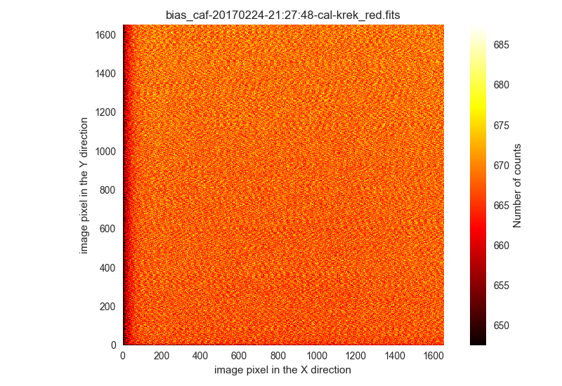
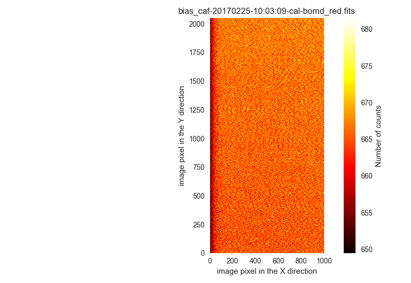
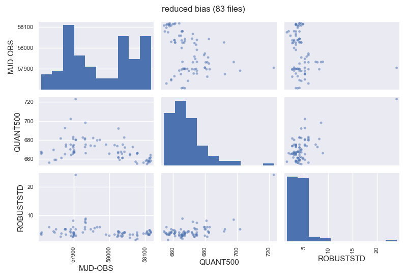
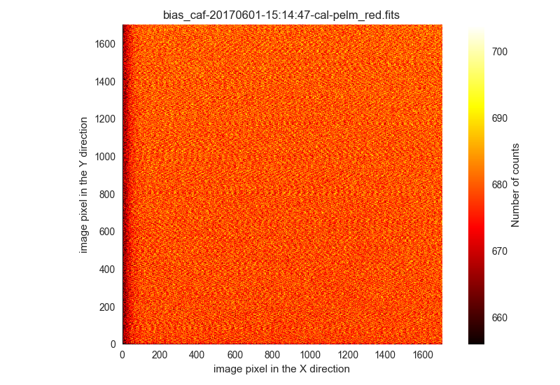
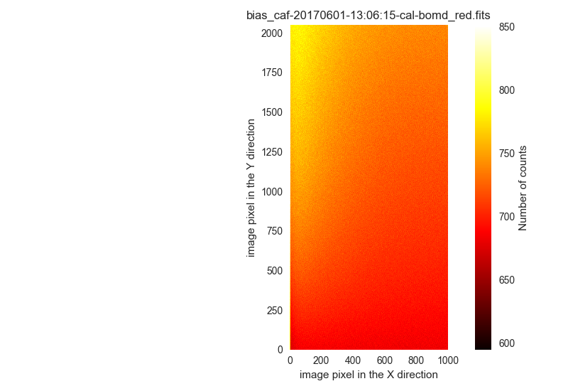

.. _reduction_of_calibration_images:

*******************************
Reduction of calibration images
*******************************

.. note::

   **Filabres** computes master calibration images for each night. Within 
   each night, individual calibration exposures within a given time span (given
   by the keyword ``maxtimespan_hours`` in the file
   ``configuration_cafos.yaml``) are combined.  Note that in order to be
   included in a particular master calibration, the corresponding individual
   images should also have the same signature, i.e., the same values for the
   set of FITS keywords listed under ``signature`` in the file
   ``configuration_cafos.yaml`` for the considered image type (``bias``,
   ``flat-imaging``,...).

Bias
====

Reduction of bias images
------------------------

The first calibration images to be reduced are the bias frames:

::

   (filabres) $ filabres -rs bias
   * Number of nights found: 58
   
   * Working with night 170225_t2_CAFOS (1/58)
   Creating bias/170225_t2_CAFOS/bias_caf-20170224-21:27:48-cal-krek_red.fits with signature SITE#1d_15__1650__1650__[251,221:1900,1870]__1__1
   Creating bias/170225_t2_CAFOS/bias_caf-20170225-10:03:09-cal-bomd_red.fits with signature SITE#1d_15__1000__2048__[501,1:1500,2048]__1__1
   
   ...
   ...

   * Working with night 171230_t2_CAFOS (58/58)
   Creating bias/171230_t2_CAFOS/bias_caf-20171229-10:12:35-cal-lilj_red.fits with signature SITE#1d_15__800__800__[601,601:1400,1400]__1__1
   * program STOP

Several warning messages may appear during the reduction of these images (they
should be the same found when classifying the images; just
ignore them). 

Note that within each night one (or several) master bias images are created.
The information on the terminal indicates the corresponding signature.

The master bias frames are stored in the subdirectory ``bias`` under the 
current directory:

::

   (filabres) $ tree bias
   bias
   ├── 170225_t2_CAFOS
   │   ├── bias_caf-20170224-21:27:48-cal-krek_red.fits
   │   └── bias_caf-20170225-10:03:09-cal-bomd_red.fits
   ├── 170226_t2_CAFOS
   │   └── bias_caf-20170226-11:39:37-cal-bomd_red.fits
   ├── 170319_t2_CAFOS
   │   └── bias_caf-20170319-09:20:09-cal-agui_red.fits
   ├── 170331_t2_CAFOS
   │   └── bias_caf-20170331-16:47:53-cal-agui_red.fits
   ├── 170403_t2_CAFOS
   │   └── bias_caf-20170403-17:27:07-cal-lilj_red.fits
   ...
   ...
   ├── 171225_t2_CAFOS
   │   ├── bias_caf-20171225-17:14:00-cal-bard_red.fits
   │   ├── bias_caf-20171225-17:43:07-cal-bard_red.fits
   │   └── bias_caf-20171225-19:48:21-cal-bard_red.fits
   ├── 171228_t2_CAFOS
   │   ├── bias_caf-20171228-13:31:20-cal-bard_red.fits
   │   └── bias_caf-20171228-13:50:00-cal-agui_red.fits
   └── 171230_t2_CAFOS
       └── bias_caf-20171229-10:12:35-cal-lilj_red.fits

If you want to get more information concerning the reduction of these type of
images, just add ``-v`` to increase the verbosity level. For example, we
can try to repeat the reduction of the last night ``171230_t2_CAFOS``:

::

   (filabres) $ filabres -rs bias -n 171230* -v --force
   * instrument............: cafos
   * datadir...............: /Users/cardiel/CAFOS2017
   * ignored_images_file...: ignored_images.yaml
   * image_corrections_file: image_header_corrections.yaml
   * Loading instrument configuration
   * Number of nights found: 1
   * List of nights: ['171230_t2_CAFOS']
   
   Results database set to filabres_db_cafos_bias.json
   
   Subdirectory bias found
   
   * Working with night 171230_t2_CAFOS (1/1)
   Reading file ./lists/171230_t2_CAFOS/imagedb_cafos.json
   Number of bias images found 10
   Subdirectory bias/171230_t2_CAFOS found
   Number of different signatures found: 1
   Signature (1/1):
    - CCDNAME: SITE#1d_15
    - NAXIS1: 800
    - NAXIS2: 800
    - DATASEC: [601,601:1400,1400]
    - CCDBINX: 1
    - CCDBINY: 1
   Total number of images with this signature: 10
    - /Users/cardiel/CAFOS2017/171230_t2_CAFOS/caf-20171229-10:12:35-cal-lilj.fits
    - /Users/cardiel/CAFOS2017/171230_t2_CAFOS/caf-20171229-10:13:11-cal-lilj.fits
    - /Users/cardiel/CAFOS2017/171230_t2_CAFOS/caf-20171229-10:13:48-cal-lilj.fits
    - /Users/cardiel/CAFOS2017/171230_t2_CAFOS/caf-20171229-10:14:23-cal-lilj.fits
    - /Users/cardiel/CAFOS2017/171230_t2_CAFOS/caf-20171229-10:14:59-cal-lilj.fits
    - /Users/cardiel/CAFOS2017/171230_t2_CAFOS/caf-20171229-10:15:35-cal-lilj.fits
    - /Users/cardiel/CAFOS2017/171230_t2_CAFOS/caf-20171229-10:16:11-cal-lilj.fits
    - /Users/cardiel/CAFOS2017/171230_t2_CAFOS/caf-20171229-10:16:48-cal-lilj.fits
    - /Users/cardiel/CAFOS2017/171230_t2_CAFOS/caf-20171229-10:17:24-cal-lilj.fits
    - /Users/cardiel/CAFOS2017/171230_t2_CAFOS/caf-20171229-10:18:00-cal-lilj.fits
   -> Number of images with expected signature and within time span: 10
   File bias/171230_t2_CAFOS/bias_caf-20171229-10:12:35-cal-lilj_red.fits already exists: skipping reduction.
   * program STOP

For this particular night, the bias images exhibit a single signature. The 10
available individual frames where obtained within one hour. For that reason all
of them are selected to be combined in a single master bias frame. The name of
output file is taken from the first image in the sequence of 10 images, adding
the prefix ``bias_`` and the suffix ``_red`` (the latter prior to the extension
``.fits``). Note however that, since **filabres** detects that the output image
already exists, the output file is not overwritten (you can force to overwrite
the output file by using the additional argument ``--force`` in the command
line).

Database of bias master frames
------------------------------

The reduction of the bias images generates a file, placed in the current
directory, called ``filabres_db_cafos_bias.json``. This constitutes a database
with the information of all the master bias images, sorted by signature and,
within each signature, sorted by the Modified Julian Date (FITS keyword
``MJD-OBS``). In this way, when a master bias is needed in the reduction of
flatfield or a scientific image, **filabres** can determine the required
calibration signature and then select the closest calibration to the
corresponding observation time.

.. warning::

   Feel free to skip the rest of this subsection. This information is not
   essential for the regular use of **filabres**.

The structure of ``filabres_db_cafos_bias.json`` is the following:

::

   {
     "bias": {...}
     "signaturekeys": [...]
   }

Under ``signaturekeys`` one finds the list of FITS keywords that determine
the signature of each master bias frame:

::

   "signaturekeys":
       "CCDNAME",
       "NAXIS1",
       "NAXIS2",
       "DATASEC",
       "CCDBINX",
       "CCDBINY"

The ``bias`` key contains a nested dictionary:

::

   "bias":
      "SITE#1d_15__1650__1650__[251,221:1900,1870]__1__1": {...}
      "SITE#1d_15__1000__2048__[501,1:1500,2048]__1__1": {...}
      "SITE#1d_15__1024__1024__[513,513:1536,1536]__1__1": {...}
      "SITE#1d_15__800__800__[625,625:1424,1424]__1__1": {...}
      "SITE#1d_15__512__850__[256,100:768,950]__2__2": {...}
      "SITE#1d_15__1400__2048__[301,1:1700,2048]__1__1": {...}
      "SITE#1d_15__850__512__[100,256:950,768]__2__2": {...}
      "SITE#1d_15__1700__1700__[201,201:1900,1900]__1__1": {...}
      "SITE#1d_15__850__850__[100,100:950,950]__2__2": {...}
      "SITE#1d_15__800__800__[601,601:1400,1400]__1__1": {...}
      "SITE#1d_15__400__2048__[801,1:1200,2048]__1__1": {...}
      "SITE#1d_15__801__1027__[624,561:1424,1587]__1__1": {...}
      "SITE#1d_15__501__501__[250,250:750,750]__2__2": {...}

Each displayed key is the signature string built from the concatenation of the
involved FITS keyword values. Within each signature one finds another nested
dictionary where the keys are the Modified Julian Date:

::

    "SITE#1d_15__1000__2048__[501,1:1500,2048]__1__1":
      "57809.42257": {...}
      "57810.48956": {...}
      "57890.69435": {...}
      "57891.57056": {...}
      "57897.69934": {...}
      "57898.17553": {...}
      "57898.69377": {...}
      "57899.16265": {...}
      "57899.65963": {...}
      "57900.17332": {...}
      "57900.69400": {...}
      "57901.68921": {...}
      "57905.54971": {...}

Within each date, the contents have the following structure:

::

      "57809.42257": {
        "night": "170225_t2_CAFOS",
        "signature": {
          "CCDNAME": "SITE#1d_15",
          "NAXIS1": 1000,
          "NAXIS2": 2048,
          "DATASEC": "[501,1:1500,2048]",
          "CCDBINX": 1,
          "CCDBINY": 1
        },
        "fname": "bias/170225_t2_CAFOS/bias_caf-20170225-10:03:09-cal-bomd_red.fits",
        "statsumm": {
          "NPOINTS": 2048000,
          "FMINIMUM": 0.5,
          "QUANT025": 657.0,
          "QUANT159": 661.5,
          "QUANT250": 663.5,
          "QUANT500": 665.5,
          "QUANT750": 668.0,
          "QUANT841": 669.5,
          "QUANT975": 673.0,
          "FMAXIMUM": 13798.0,
          "ROBUSTSTD": 3.3358499999999998
        },
        "masterkeywords": {
          "NAXIS": 2,
          "NAXIS1": 1000,
          "NAXIS2": 2048,
          "OBJECT": "[bias]",
          "RA": 303.714233,
          "DEC": 37.23009,
          "EQUINOX": 2000.0,
          "DATE": "2017-02-25T10:03:09",
          "MJD-OBS": 57809.4188,
          "AIRMASS": 1.0,
          "EXPTIME": 0.0,
          "INSTRUME": "CAFOS 2.2",
          "CCDNAME": "SITE#1d_15",
          "ORIGSECX": 2048.0,
          "ORIGSECY": 2048.0,
          "CCDSEC": "[501,1:1500,2048]",
          "BIASSEC": "[0,1:0,2048]",
          "DATASEC": "[501,1:1500,2048]",
          "CCDBINX": 1,
          "CCDBINY": 1,
          "IMAGETYP": "bias",
          "INSTRMOD": "Polarizer",
          "INSAPID": "SLIT",
          "INSTRSCL": 0.53,
          "INSTRPIX": 24.0,
          "INSTRPX0": 1054.57,
          "INSTRPY0": 1060.85,
          "INSFLID": "FILT-12",
          "INSFLNAM": "free",
          "INSGRID": "GRISM- 1",
          "INSGRNAM": "blue-100",
          "INSGRROT": 359.72,
          "INSGRWL0": 423.8,
          "INSGRRES": 0.199,
          "INSPOFPI": "FREE",
          "INSPOROT": 0,
          "INSFPZ": 0,
          "INSFPWL": "not used",
          "INSFPDWL": "not used",
          "INSFPORD": "not used",
          "INSCALST": false,
          "INSCALID": "Lamp",
          "INSCALNM": "    /    /"
        },
        "norigin": 10,
        "originf": [
          "caf-20170225-10:03:09-cal-bomd.fits",
          "caf-20170225-10:04:20-cal-bomd.fits",
          "caf-20170225-10:05:32-cal-bomd.fits",
          "caf-20170225-10:06:44-cal-bomd.fits",
          "caf-20170225-10:07:56-cal-bomd.fits",
          "caf-20170225-10:09:08-cal-bomd.fits",
          "caf-20170225-10:10:19-cal-bomd.fits",
          "caf-20170225-10:11:31-cal-bomd.fits",
          "caf-20170225-10:12:43-cal-bomd.fits",
          "caf-20170225-10:13:55-cal-bomd.fits"
        ]
      }

Without entering in too many details, the displayed information includes
the file name for the corresponding master bias ``fname``, the individual
images involved ``originf``, the values of all the FITS keywords listed in
``masterkeywords``, and the statistical summary of the master image
``statsumm``, to mention the most relevant items.

Checking the bias reduction
---------------------------

Fortunately, you do not need to manually examine the file
``filabres_db_cafos_bias.json`` to check the reduction of bias images.

The argument ``-lr`` allows to list the result of the reduction of some
particular images. It works in a similar way as the ``-lc`` argument,
previously used to list the classified images (*be careful not to confuse
them*).

In order to check the reduction of the bias images just execute:

::

   (filabres) $ filabres -lr bias
                                                                    file NAXIS1 NAXIS2
   1   bias/170225_t2_CAFOS/bias_caf-20170224-21:27:48-cal-krek_red.fits  1650   1650 
   2   bias/170225_t2_CAFOS/bias_caf-20170225-10:03:09-cal-bomd_red.fits  1000   2048 
   3   bias/170226_t2_CAFOS/bias_caf-20170226-11:39:37-cal-bomd_red.fits  1000   2048 
   ...
   ...
   81  bias/170807_t2_CAFOS/bias_caf-20170808-04:55:29-cal-schn_red.fits  400    2048 
   82  bias/170928_t2_CAFOS/bias_caf-20170928-15:14:46-cal-wenj_red.fits  801    1027 
   83  bias/170929_t2_CAFOS/bias_caf-20170929-14:26:11-cal-wenj_red.fits  501    501  
   Total: 83 files

It is possible to filter the list by night (wildcards allowed here). For
example, for the first night:

::

   (filabres) $ filabres -lr bias -n 170225*
                                                                   file NAXIS1 NAXIS2
   1  bias/170225_t2_CAFOS/bias_caf-20170224-21:27:48-cal-krek_red.fits  1650   1650 
   2  bias/170225_t2_CAFOS/bias_caf-20170225-10:03:09-cal-bomd_red.fits  1000   2048

There are two master bias, with different signature. It is possible to display
them (``-pi``):

::

   (filabres) $ filabres -lr bias -n 170225* -pi
   ...
   ...

You can use ``-k all`` to show the whole list of available keywords:

::

   (filabres) $ filabres -lr bias -k all
   Valid keywords: ['NAXIS', 'NAXIS1', 'NAXIS2', 'OBJECT', 'RA', 'DEC',
   'EQUINOX', 'DATE', 'MJD-OBS', 'AIRMASS', 'EXPTIME', 'INSTRUME', 'CCDNAME',
   'ORIGSECX', 'ORIGSECY', 'CCDSEC', 'BIASSEC', 'DATASEC', 'CCDBINX',
   'CCDBINY', 'IMAGETYP', 'INSTRMOD', 'INSAPID', 'INSTRSCL', 'INSTRPIX',
   'INSTRPX0', 'INSTRPY0', 'INSFLID', 'INSFLNAM', 'INSGRID', 'INSGRNAM',
   'INSGRROT', 'INSGRWL0', 'INSGRRES', 'INSPOFPI', 'INSPOROT', 'INSFPZ',
   'INSFPWL', 'INSFPDWL', 'INSFPORD', 'INSCALST', 'INSCALID', 'INSCALNM',
   'NPOINTS', 'FMINIMUM', 'QUANT025', 'QUANT159', 'QUANT250', 'QUANT500',
   'QUANT750', 'QUANT841', 'QUANT975', 'FMAXIMUM', 'ROBUSTSTD', 'NORIGIN']

Remember that you can generate a table with any selection of these keywords
(``-k <keyword1> -k <keyword2>...``), sort that table by any combination of
keywords (``-ks <keyword1> -ks <keyword2>...``), and generate XY plot with
combinations of numerical keywords (``-pxy``).

For the bias images, it is interesting to check the plot that compares the
evolution of the median bias level (``QUANT500``) with the observation date
(``MJD-OBS``), sorting the table by robust standard deviation (``ROBUSTSTD``):

::

   (filabres) $ filabres -lr bias -k mjd-obs -k quant500 -ks robuststd -pxy
                                                                    file      MJD-OBS   QUANT500  ROBUSTSTD
   78  bias/171116_t2_CAFOS/bias_caf-20171116-14:06:06-cal-lilj_red.fits  58073.58750  657.00000  1.48260  
   58  bias/171121_t2_CAFOS/bias_caf-20171121-15:21:37-cal-bomd_red.fits  58078.64000  666.00000  1.85325  
   46  bias/171101_t2_CAFOS/bias_caf-20171031-14:14:01-cal-agui_red.fits  58057.59300  665.00000  2.22390  
   ...
   ...
   72  bias/170628_t2_CAFOS/bias_caf-20170628-17:29:10-cal-pelm_red.fits  57932.72860  698.00000  8.52495  
   56  bias/170629_t2_CAFOS/bias_caf-20170629-17:41:33-cal-mirl_red.fits  57933.73719  666.00000  8.89560  
   14  bias/170601_t2_CAFOS/bias_caf-20170601-13:06:15-cal-bomd_red.fits  57905.54600  723.00000  24.09225 
   Total: 83 files

Since we have sorted this last table by ``ROBUSTSTD``, the last row, which
corresponds to
``bias/170601_t2_CAFOS/bias_caf-20170601-13:06:15-cal-bomd_red.fits``,
indicates that this image has an unusually high median and robust standard
deviation. That image corresponding to night ``20170601``. Let's display the
master bias generated in that night:

::

   (filabres) $ filabres -lr bias -k mjd-obs -k quant500 -ks robuststd -n 170601* -pi
                                                                   file     MJD-OBS  QUANT500  ROBUSTSTD
   2  bias/170601_t2_CAFOS/bias_caf-20170601-15:14:47-cal-pelm_red.fits  57905.6352  680.0     5.18910  
   1  bias/170601_t2_CAFOS/bias_caf-20170601-13:06:15-cal-bomd_red.fits  57905.5460  723.0     24.09225 
   Total: 2 files

The first master bias looks normal:

However, the second bias exhibit a clear illumination gradient, specially
noticeable in the upper left corner of the detector:

It is likely that the individual bias exposures employed to generate the last
master bias frame have the same problem. You can verify this by using
``-of/--originf <path_reduced_calibration_image>``, that list the individual images employed in the generation
of a particular reduced calibration image (this new arguments allows the
additional use of ``-k <keyword>``, ``-ks <keyword>``, ``-pxy`` and ``-pi``):

::

   (filabres) $ filabres -of bias/170601_t2_CAFOS/bias_caf-20170601-13:06:15-cal-bomd_red.fits \
   -k quant500 -k robuststd
   > Signature: SITE#1d_15__1000__2048__[501,1:1500,2048]__1__1
   > Available images with this signature:
   MJD-OBS: 57809.42257, calibration: bias/170225_t2_CAFOS/bias_caf-20170225-10:03:09-cal-bomd_red.fits
   MJD-OBS: 57810.48956, calibration: bias/170226_t2_CAFOS/bias_caf-20170226-11:39:37-cal-bomd_red.fits
   MJD-OBS: 57890.69435, calibration: bias/170517_t2_CAFOS/bias_caf-20170517-16:34:30-cal-bomd_red.fits
   MJD-OBS: 57891.57056, calibration: bias/170518_t2_CAFOS/bias_caf-20170518-13:36:14-cal-bomd_red.fits
   MJD-OBS: 57897.69934, calibration: bias/170524_t2_CAFOS/bias_caf-20170524-16:41:41-cal-boeh_red.fits
   MJD-OBS: 57898.17553, calibration: bias/170524_t2_CAFOS/bias_caf-20170525-04:07:28-cal-boeh_red.fits
   MJD-OBS: 57898.69377, calibration: bias/170525_t2_CAFOS/bias_caf-20170525-16:33:40-cal-boeh_red.fits
   MJD-OBS: 57899.16265, calibration: bias/170525_t2_CAFOS/bias_caf-20170526-03:48:53-cal-boeh_red.fits
   MJD-OBS: 57899.65963, calibration: bias/170526_t2_CAFOS/bias_caf-20170526-15:44:34-cal-boeh_red.fits
   MJD-OBS: 57900.17332, calibration: bias/170526_t2_CAFOS/bias_caf-20170527-04:04:16-cal-boeh_red.fits
   MJD-OBS: 57900.69400, calibration: bias/170527_t2_CAFOS/bias_caf-20170527-16:34:04-cal-boeh_red.fits
   MJD-OBS: 57901.68921, calibration: bias/170528_t2_CAFOS/bias_caf-20170528-16:27:05-cal-boeh_red.fits
   MJD-OBS: 57905.54971, calibration: bias/170601_t2_CAFOS/bias_caf-20170601-13:06:15-cal-bomd_red.fits (*)
   ---
   > List of individual frames:
     (involved in the computation of bias/170601_t2_CAFOS/bias_caf-20170601-13:06:15-cal-bomd_red.fits)
                                                                               file  QUANT500  ROBUSTSTD
   1   /Users/cardiel/CAFOS2017/170601_t2_CAFOS/caf-20170601-13:06:15-cal-bomd.fits  722.0     25.2042  
   2   /Users/cardiel/CAFOS2017/170601_t2_CAFOS/caf-20170601-13:07:26-cal-bomd.fits  722.0     25.2042  
   3   /Users/cardiel/CAFOS2017/170601_t2_CAFOS/caf-20170601-13:08:38-cal-bomd.fits  722.0     25.2042  
   4   /Users/cardiel/CAFOS2017/170601_t2_CAFOS/caf-20170601-13:09:50-cal-bomd.fits  722.0     25.2042  
   5   /Users/cardiel/CAFOS2017/170601_t2_CAFOS/caf-20170601-13:11:02-cal-bomd.fits  722.0     25.2042  
   6   /Users/cardiel/CAFOS2017/170601_t2_CAFOS/caf-20170601-13:12:14-cal-bomd.fits  723.0     25.9455  
   7   /Users/cardiel/CAFOS2017/170601_t2_CAFOS/caf-20170601-13:13:25-cal-bomd.fits  723.0     25.2042  
   8   /Users/cardiel/CAFOS2017/170601_t2_CAFOS/caf-20170601-13:14:37-cal-bomd.fits  723.0     25.2042  
   9   /Users/cardiel/CAFOS2017/170601_t2_CAFOS/caf-20170601-13:15:48-cal-bomd.fits  723.0     25.2042  
   10  /Users/cardiel/CAFOS2017/170601_t2_CAFOS/caf-20170601-13:17:01-cal-bomd.fits  723.0     25.9455  
   Total: 10 files

The output of the last command provides very useful information:

- ``> Signature``: indicates the particular signature of the calibration image.

- ``> Available reduced images with this signature``: the modified Julian Date
  and the name of the calibration file is given. An asterisk ``(*)`` appears
  after the name of the reduced image we are investigating. **The list reveals
  that there are other reduced bias images with the same signature**. This is
  important because if we decide to remove the suspicious calibration image,
  there will be additional calibration images with the same signature that can
  be employed (although from different nights).

- ``> List of individual frames:`` list of individual images employed in the
  reduction of the reduced image indicated after the argument ``-of``. This
  list is a table with the additional requested keywords.

In this case, we confirm that the high median and robust standard deviation
values are also present in the individual images employed to generate the
suspicious reduced bias image. Not only that. The illumination gradient is also
present in the 10 individual images, as can be easily visualized using ``-pi``:

::

   (filabres) $ filabres -of bias/170601_t2_CAFOS/bias_caf-20170601-13:06:15-cal-bomd_red.fits \
   -k quant500 -k robuststd -pi
   ...
   ...

(Note: the 10 displayed images are quite similar to the one shown here)

Removing invalid reduced bias
-----------------------------

.. warning::

   In order to remove a particular reduced calibration (in this case a master
   bias) it is important to follow **all the steps** here given.

1. Include individual images in ``ignored_images.yaml``: in this example, we
   want to exclude 10 images from night ``170601_t2_CAFOS``. The easiest way
   is to repeat the execution of the last **filabres** command, by adding
   ``-lm basic`` (basic list mode), which will provide a list of ten files
   that we can *cut and paste* in the file ``ignored_images.yaml``. Step by
   step, the procedure is:

   - 1.a. Execute:

      ::

        (filabres) $ filabres -of bias/170601_t2_CAFOS/bias_caf-20170601-13:06:15-cal-bomd_red.fits -lm basic
        ...
        ...
        > List of individual frames:
          (involved in the computation of bias/170601_t2_CAFOS/bias_caf-20170601-13:06:15-cal-bomd_red.fits)
         - caf-20170601-13:06:15-cal-bomd.fits
         - caf-20170601-13:07:26-cal-bomd.fits
         - caf-20170601-13:08:38-cal-bomd.fits
         - caf-20170601-13:09:50-cal-bomd.fits
         - caf-20170601-13:11:02-cal-bomd.fits
         - caf-20170601-13:12:14-cal-bomd.fits
         - caf-20170601-13:13:25-cal-bomd.fits
         - caf-20170601-13:14:37-cal-bomd.fits
         - caf-20170601-13:15:48-cal-bomd.fits
         - caf-20170601-13:17:01-cal-bomd.fits
        Total: 10 files

   - 1.b. Cut and paste the last 10 lines starting by ``-`` into the file
     ``ignored_image.yaml``, creating a new block for night
     ``170601_t2_CAFOS``. Considering that we already had 4 blocks in this
     file, we insert a fifth block (the order of the blocks is irrelevant, but
     here we preserve the order given by the observing night just to
     facilitate the organization of the blocks), so the final content of this
     file is:

     .. literalinclude:: ignored_images_v2.yaml
        :linenos:
        :lineno-start: 1
        :emphasize-lines: 17-29

     Note that the new block correspond to the highlighted lines 17 to 29. In
     this case, the explicit names of the ten files have been used (no
     wildcards employed).

2. Re-run the image classification for the corresponding observing night: this
   will regenerate the local image database ``imagedb_cafos.json`` for the
   night ``170601_t2_CAFOS``, ignoring the problematic files. Note that if
   you simple execute:

   ::

      (filabres) $ filabres -rs initialize -n 170601*
      * Number of nights found: 1
      File ./lists/170601_t2_CAFOS/imagedb_cafos.json already exists: skipping directory.
      * program STOP

   nothing really happens because the local database already exists. You have
   to force the classification in order to override the database file:

   ::

      (filabres) $ filabres -rs initialize -n 170601* --force
      * Number of nights found: 1
      * Working with night 170601_t2_CAFOS (1/1) ---> 96 FITS files
      * program STOP

   Check that the images have in fact been ignored:

   ::

      $ filabres -lc ignored -n 170601*
                                                                                              file NAXIS1 NAXIS2
      1   /Volumes/NicoPassport/CAHA/CAFOS2017/170601_t2_CAFOS/caf-20170601-13:06:15-cal-bomd.fits  1000   2048 
      2   /Volumes/NicoPassport/CAHA/CAFOS2017/170601_t2_CAFOS/caf-20170601-13:07:26-cal-bomd.fits  1000   2048 
      3   /Volumes/NicoPassport/CAHA/CAFOS2017/170601_t2_CAFOS/caf-20170601-13:08:38-cal-bomd.fits  1000   2048 
      4   /Volumes/NicoPassport/CAHA/CAFOS2017/170601_t2_CAFOS/caf-20170601-13:09:50-cal-bomd.fits  1000   2048 
      5   /Volumes/NicoPassport/CAHA/CAFOS2017/170601_t2_CAFOS/caf-20170601-13:11:02-cal-bomd.fits  1000   2048 
      6   /Volumes/NicoPassport/CAHA/CAFOS2017/170601_t2_CAFOS/caf-20170601-13:12:14-cal-bomd.fits  1000   2048 
      7   /Volumes/NicoPassport/CAHA/CAFOS2017/170601_t2_CAFOS/caf-20170601-13:13:25-cal-bomd.fits  1000   2048 
      8   /Volumes/NicoPassport/CAHA/CAFOS2017/170601_t2_CAFOS/caf-20170601-13:14:37-cal-bomd.fits  1000   2048 
      9   /Volumes/NicoPassport/CAHA/CAFOS2017/170601_t2_CAFOS/caf-20170601-13:15:48-cal-bomd.fits  1000   2048 
      10  /Volumes/NicoPassport/CAHA/CAFOS2017/170601_t2_CAFOS/caf-20170601-13:17:01-cal-bomd.fits  1000   2048 
      Total: 10 files

3. Remove the problematic reduced image from ``filabres_db_cafos_bias.json``,
   the database that contains all the reduced bias frames. Note that the
   undesired reduced calibration is not only still present in that database,
   but the reduced FITS file is still under the ``bias`` subdirectory that
   hosts all the reduced bias frames (so far we have only removed the
   individual original FITS files from the classication of the images). Taking
   care of removing both the reduced image from the database and the actual
   FITS file from the hard disk is handled by **filabres** using a single
   command:

   ::

      (filabres) $ filabres --delete bias/170601_t2_CAFOS/bias_caf-20170601-13:06:15-cal-bomd_red.fits

   (Work in progress)

Flat-imaging
============
(Still work in progress)

Reduction of flat-imaging images
--------------------------------

Database of flat-imaging master frames
--------------------------------------

Checking the flat-imaging reduction
-----------------------------------

Removing invalid reduced flat-imaging
-------------------------------------

