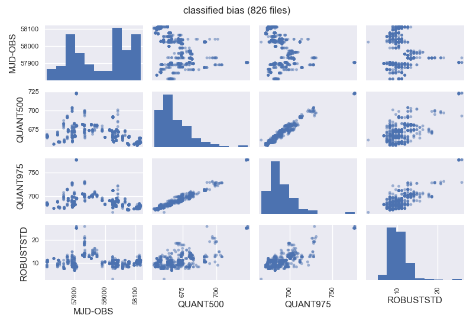

.. _image_classification:

********************
Image classification
********************

Rules for the classification of the images
==========================================

The image
classification will take place by generating a local database (a JSON file
called ``imagedb_cafos.json``) for each observing night. For this purpose,
**filabres** will follow the rules provided in the instrument configuration
file ``configuration_cafos.yaml``. Note that this file is embedded in the
distribution source code, under the directory ``filabres/instrument/``.

.. warning::

   Since the modification of the file ``configuration_cafos.yaml`` could change
   the classification of the images perfomerd by **filabres**, in principle
   this file should not be modified by a normal user. In any case, if you want
   to change it, it will be necessary to reinstall the code for the changes to
   be applied.

In its first hierarchical level, this file ``configuration_cafos.yaml`` defines
the following keys: ``instname``, ``version``, ``requirements``,
``masterkeywords``, and ``imagetypes``:

::

  instname: cafos
  version: 2.3
  requirements:
    INSTRUME: 'CAFOS 2.2'
  masterkeywords:
    - NAXIS      # number of data axes
    - NAXIS1     # length of data axis 1
    - NAXIS2     # length of data axis 2
    - OBJECT     # Target description
    ...
    ...
  imagetypes:
    bias:
      ...
      ...
    flat-imaging:
      ...
      ...
    flat-imaging-wollaston:
      ...
      ...
    flat-spectroscopy:
      ...
      ...
    arc:
      ...
      ...
    science-imaging:
      ...
      ...
    science-imaging-wollaston:
      ...
      ...
    science-spectroscopy:
      ...
      ...

- ``instname``: the instrument name.

- ``version``: the version of the instrument configuration file.

- ``requirements``: the value of predefined FITS keywords that must be
  satisfied in order to classified the initial image within one of the
  categories defined below. If these requirements are not fulfilled, the image
  will be classified as ``wrong-instrument``. For this particular example, a
  single requirement has been defined: the keyword ``INSTRUME`` must be defined
  in the FITS header and must be set to ``CAFOS 2.2``.

- ``masterkeywords``: list of keywords that must be stored in the local
  database.

- ``imagetypes``: the different categories into which the initial images will
  be classified are provided as second-level dictionary of image types (e.g.:
  ``bias``, ``flat-imaging``, ``science-imaging``, etc.). 
  In order to proceed with this classification, each image type
  should be defined according to a third-level dictionary of
  keywords. For example, the image type ``bias`` is defined as:

  ::

    imagetype:
      bias:
        executable: True
        classification: calibration
        requirements:
          IMAGETYP: 'bias'
        requirementx:
          EXPTIME: 0.0
          QUANT975.LT.: 1000
        signature:
          - CCDNAME
          - NAXIS1
          - NAXIS2
          - DATASEC
          - CCDBINX
          - CCDBINY
        maxtimespan_hours: 1

  The relevant keywords in this third-level dictionary are:

  - ``executable``: if True, the reduction of this image type has been
    considered in **filabres**. Otherwise, the implementation of the reduction
    of this type of images is still pending.

  - ``classification``: so far only two possibilities are valid here:
    ``calibration`` or ``science``. Note that calibration images will be
    combined to generate master calibrations (e.g., bias frames
    obtained in a predefined time span will be coadded), whereas science frames
    will be independently reduced (i.e., without image coaddition).

  - ``requirements``: conditions on FITS keywords that must be met in order to
    classify a particular image within the considered category. All these
    requirements are mandatory. Otherwise the image will be classified as
    ``unclassified``. 

  - ``requirementx``: additional set of requirements . If any of these new
    requirements is not met, the image will be classified as
    ``wrong-<imagetype>`` (e.g., ``bias-wrong``, ``flat-imaging-wrong``, etc.). 
    Note that the separation of the requirements in
    these two sets (``requirements`` and ``requirementx``) allows to generate a
    classification where images initially classified within a given image type
    (because they verify all the ``requirements``) can be flagged as suspicious 
    because they exhibit an unexpected property (defined in the
    ``requirementx``), such as anomalous exposure time or signal.

Note that images previously included in the file ``ignored_images.yaml`` will
be classified as ``ignored``.

Inital image classification
===========================

The image classification is performed by starting the reduction step
``initialize``. Reduction steps are executed with the argument
``-rs/--reduction_step``. In this case execute (note that this can take several
minutes!):

::

  $ filabres -rs initialize
  * Number of nights found: 58
  * Working with night 170225_t2_CAFOS (1/58) ---> 140 FITS files
  * Working with night 170226_t2_CAFOS (2/58) ---> 55 FITS files
  ...
  ...
  * Working with night 171228_t2_CAFOS (57/58) ---> 50 FITS files
  * Working with night 171230_t2_CAFOS (58/58) ---> 383 FITS files
  * program STOP 

A few warnings may be raised during the execution of the program. In particular
for the CAFOS 2017 data, the ``MJD-OBS`` is negative in some images and
**filabres** recomputes it. In other cases, ``HIERARCHCAHA DET CCDS`` is found,
when it sould be ``HIERARCH CAHA DET CCDS``.

After the execution of previous command, a new subdirectory ``lists`` should
have appear in your working directory, containing subdirectories for all the
observing nights:

::

  $ ls lists/
  170225_t2_CAFOS/ 170524_t2_CAFOS/ 170807_t2_CAFOS/ 171108_t2_CAFOS/
  170226_t2_CAFOS/ 170525_t2_CAFOS/ 170809_t2_CAFOS/ 171116_t2_CAFOS/
  170319_t2_CAFOS/ 170526_t2_CAFOS/ 170811_t2_CAFOS/ 171120_t2_CAFOS/
  170331_t2_CAFOS/ 170527_t2_CAFOS/ 170825_t2_CAFOS/ 171121_t2_CAFOS/
  170403_t2_CAFOS/ 170528_t2_CAFOS/ 170903_t2_CAFOS/ 171209_t2_CAFOS/
  170408_t2_CAFOS/ 170601_t2_CAFOS/ 170918_t2_CAFOS/ 171217_t2_CAFOS/
  170420_t2_CAFOS/ 170602_t2_CAFOS/ 170926_t2_CAFOS/ 171218_t2_CAFOS/
  170422_t2_CAFOS/ 170621_t2_CAFOS/ 170928_t2_CAFOS/ 171219_t2_CAFOS/
  170502_t2_CAFOS/ 170627_t2_CAFOS/ 170929_t2_CAFOS/ 171221_t2_CAFOS/
  170505_t2_CAFOS/ 170628_t2_CAFOS/ 171002_t2_CAFOS/ 171223_t2_CAFOS/
  170506_t2_CAFOS/ 170629_t2_CAFOS/ 171008_t2_CAFOS/ 171225_t2_CAFOS/
  170507_t2_CAFOS/ 170713_t2_CAFOS/ 171011_t2_CAFOS/ 171228_t2_CAFOS/
  170517_t2_CAFOS/ 170720_t2_CAFOS/ 171015_t2_CAFOS/ 171230_t2_CAFOS/
  170518_t2_CAFOS/ 170724_t2_CAFOS/ 171016_t2_CAFOS/
  170519_t2_CAFOS/ 170731_t2_CAFOS/ 171101_t2_CAFOS/

Within each night, a file ``imagedb_cafos.json`` should have been created, 
storing the image classification.

::

  $ ls lists/170225_t2_CAFOS/
  imagedb_cafos.json

For those nights with images that have raised WARNINGS during the image
classification, an additional ``imagedb_cafos.log`` file should also have been
created containing the warning messages:

::

  $ find lists -name *log | sort
  lists/170408_t2_CAFOS/imagedb_cafos.log
  lists/170502_t2_CAFOS/imagedb_cafos.log
  lists/170507_t2_CAFOS/imagedb_cafos.log
  lists/170517_t2_CAFOS/imagedb_cafos.log
  lists/170518_t2_CAFOS/imagedb_cafos.log
  lists/170524_t2_CAFOS/imagedb_cafos.log
  lists/170525_t2_CAFOS/imagedb_cafos.log
  lists/170526_t2_CAFOS/imagedb_cafos.log
  lists/170527_t2_CAFOS/imagedb_cafos.log
  lists/170528_t2_CAFOS/imagedb_cafos.log
  lists/170621_t2_CAFOS/imagedb_cafos.log
  lists/170627_t2_CAFOS/imagedb_cafos.log
  lists/170628_t2_CAFOS/imagedb_cafos.log
  lists/170629_t2_CAFOS/imagedb_cafos.log
  lists/170713_t2_CAFOS/imagedb_cafos.log
  lists/170731_t2_CAFOS/imagedb_cafos.log
  lists/170807_t2_CAFOS/imagedb_cafos.log
  lists/170811_t2_CAFOS/imagedb_cafos.log
  lists/170918_t2_CAFOS/imagedb_cafos.log
  lists/170928_t2_CAFOS/imagedb_cafos.log
  lists/170929_t2_CAFOS/imagedb_cafos.log
  lists/171011_t2_CAFOS/imagedb_cafos.log
  lists/171015_t2_CAFOS/imagedb_cafos.log
  lists/171016_t2_CAFOS/imagedb_cafos.log
  lists/171108_t2_CAFOS/imagedb_cafos.log
  lists/171116_t2_CAFOS/imagedb_cafos.log
  lists/171120_t2_CAFOS/imagedb_cafos.log
  lists/171218_t2_CAFOS/imagedb_cafos.log
  lists/171219_t2_CAFOS/imagedb_cafos.log

All the warnings raised in the classification of the CAFOS 2017 data can safely
be ignored.

Examine the image classification
================================

Select image type
-----------------

Although you can always try to open any of the files ``imagedb_cafos.json``
directly (using a proper JSON editor), **filabres** provides an easier way to
examine the image classification previously performed (using the argument
``-lc/--list_classified <imagetype>``). 
For example, to list the different image types available:

::

  $ filabres -lc
  Valid imagetypes:
  - bias
  - flat-imaging
  - flat-imaging-wollaston
  - flat-spectroscopy
  - arc
  - science-imaging
  - science-imaging-wollaston
  - science-spectroscopy
  - wrong-bias
  - wrong-flat-imaging
  - wrong-flat-imaging-wollaston
  - wrong-flat-spectroscopy
  - wrong-arc
  - wrong-science-imaging
  - wrong-science-imaging-wollaston
  - wrong-science-spectroscopy
  - wrong-instrument
  - ignored
  - unclassified

You can repeat the same command by adding any of the above image types:

::

  $ filabres -lc bias
                                                                                           file
  1    /Volumes/NicoPassport/CAHA/CAFOS2017/170225_t2_CAFOS/caf-20170224-21:27:48-cal-krek.fits
  2    /Volumes/NicoPassport/CAHA/CAFOS2017/170225_t2_CAFOS/caf-20170224-21:29:09-cal-krek.fits
  3    /Volumes/NicoPassport/CAHA/CAFOS2017/170225_t2_CAFOS/caf-20170224-21:30:31-cal-krek.fits
  ...
  ...
  824  /Volumes/NicoPassport/CAHA/CAFOS2017/171230_t2_CAFOS/caf-20171229-10:16:48-cal-lilj.fits
  825  /Volumes/NicoPassport/CAHA/CAFOS2017/171230_t2_CAFOS/caf-20171229-10:17:24-cal-lilj.fits
  826  /Volumes/NicoPassport/CAHA/CAFOS2017/171230_t2_CAFOS/caf-20171229-10:18:00-cal-lilj.fits
  Total: 826 files

By default the list displays the full path to the original files.
   
Select image type and observing nights
--------------------------------------

It is possible to constraint the list of files to those corresponding to a
given subset of nights (using the argument ``-n/--night <night>``; wildcards are valid
here):

::

  $ filabres -lc bias -n 1702*
                                                                                          file
  1   /Volumes/NicoPassport/CAHA/CAFOS2017/170225_t2_CAFOS/caf-20170224-21:27:48-cal-krek.fits
  2   /Volumes/NicoPassport/CAHA/CAFOS2017/170225_t2_CAFOS/caf-20170224-21:29:09-cal-krek.fits
  3   /Volumes/NicoPassport/CAHA/CAFOS2017/170225_t2_CAFOS/caf-20170224-21:30:31-cal-krek.fits
  ...
  ...
  28  /Volumes/NicoPassport/CAHA/CAFOS2017/170226_t2_CAFOS/caf-20170226-11:47:59-cal-bomd.fits
  29  /Volumes/NicoPassport/CAHA/CAFOS2017/170226_t2_CAFOS/caf-20170226-11:49:11-cal-bomd.fits
  30  /Volumes/NicoPassport/CAHA/CAFOS2017/170226_t2_CAFOS/caf-20170226-11:50:23-cal-bomd.fits
  Total: 30 files

Select image type and relevant keywords
---------------------------------------

You can also display the values of relevant keywords belonging to the
``masterkeywords`` list in the file ``configuration_cafos.yaml``. If you don't
remember them, don't worry: use first ``-k/--keyword all`` to display all the 
available keywords:

::

  $ filabres -lc bias -k all
  Valid keywords: ['NAXIS', 'NAXIS1', 'NAXIS2', 'OBJECT', 'RA', 'DEC',
  'EQUINOX', 'DATE', 'MJD-OBS', 'AIRMASS', 'EXPTIME', 'INSTRUME', 'CCDNAME',
  'ORIGSECX', 'ORIGSECY', 'CCDSEC', 'BIASSEC', 'DATASEC', 'CCDBINX',
  'CCDBINY', 'IMAGETYP', 'INSTRMOD', 'INSAPID', 'INSTRSCL', 'INSTRPIX',
  'INSTRPX0', 'INSTRPY0', 'INSFLID', 'INSFLNAM', 'INSGRID', 'INSGRNAM',
  'INSGRROT', 'INSGRWL0', 'INSGRRES', 'INSPOFPI', 'INSPOROT', 'INSFPZ',
  'INSFPWL', 'INSFPDWL', 'INSFPORD', 'INSCALST', 'INSCALID', 'INSCALNM',
  'NPOINTS', 'FMINIMUM', 'QUANT025', 'QUANT159', 'QUANT250', 'QUANT500',
  'QUANT750', 'QUANT841', 'QUANT975', 'FMAXIMUM', 'ROBUSTSTD']

.. note::

   Note that, apart from the keywords belonging to the ``masterkeywords`` list
   in the file ``configuration_cafos.yaml``, some additional *statistical*
   keywords are also available:

   - ``NPOINTS``: number of points in the image

   - ``FMINIMUM``, ``FMAXIMUM``: mininum and maximum signal in the image.

   - ``QUANT025``, ``QUANT159``,... ``QUANT975``: 0.025,
     0.159, 0.250, 0.500, 0.750, 0.841 and 0.975 quantiles of the data.

   - ``ROBUSTSTD``: robust estimate of the standard deviation, computed as
     0.7413*(``QUANT750``-``QUANT250``).

Let's display the values of a few of keywords: ``QUANT500`` (the image median),
``QUANT975`` (the quantile 0.975 of the image), and ``ROBUSTSTD`` (the robust
standard deviation of the image):

::

  $ filabres -lc bias -k quant500 -k quant975 -k robuststd
        QUANT500   QUANT975  ROBUSTSTD                                                                                      file
  1    666.00000  686.00000  11.11950   /Volumes/NicoPassport/CAHA/CAFOS2017/170225_t2_CAFOS/caf-20170224-21:27:48-cal-krek.fits
  2    666.00000  687.00000  10.37820   /Volumes/NicoPassport/CAHA/CAFOS2017/170225_t2_CAFOS/caf-20170224-21:29:09-cal-krek.fits
  3    666.00000  683.00000  10.37820   /Volumes/NicoPassport/CAHA/CAFOS2017/170225_t2_CAFOS/caf-20170224-21:30:31-cal-krek.fits
  ...
  ...
  824  658.00000  680.00000  11.11950   /Volumes/NicoPassport/CAHA/CAFOS2017/171230_t2_CAFOS/caf-20171229-10:16:48-cal-lilj.fits
  825  658.00000  680.00000  11.11950   /Volumes/NicoPassport/CAHA/CAFOS2017/171230_t2_CAFOS/caf-20171229-10:17:24-cal-lilj.fits
  826  658.00000  680.00000  11.11950   /Volumes/NicoPassport/CAHA/CAFOS2017/171230_t2_CAFOS/caf-20171229-10:18:00-cal-lilj.fits
  Total: 826 files

Note that each keyword is preceded by ``-k`` (following the astropy convention
for the ``fitsheader`` utility).

If instead of using ``-k/--keyword`` you use ``-ks/--keyword_sort``, the list
will be sorted according to the selected keywords (several keys can be used for
a hierarchical sorting):

::

  $ filabres -lc bias -k quant500 -k quant975 -ks robuststd
        QUANT500   QUANT975  ROBUSTSTD                                                                                      file
  456  661.40002  666.70001  2.81693    /Volumes/NicoPassport/CAHA/CAFOS2017/170929_t2_CAFOS/caf-20170929-13:52:35-cal-bias.fits
  206  667.00000  683.00000  6.67170    /Volumes/NicoPassport/CAHA/CAFOS2017/170526_t2_CAFOS/caf-20170526-15:44:34-cal-boeh.fits
  207  667.00000  683.00000  6.67170    /Volumes/NicoPassport/CAHA/CAFOS2017/170526_t2_CAFOS/caf-20170526-15:45:45-cal-boeh.fits
  ...
  ...
  241  723.00000  776.00000  25.94550   /Volumes/NicoPassport/CAHA/CAFOS2017/170601_t2_CAFOS/caf-20170601-13:12:14-cal-bomd.fits
  245  723.00000  776.00000  25.94550   /Volumes/NicoPassport/CAHA/CAFOS2017/170601_t2_CAFOS/caf-20170601-13:17:01-cal-bomd.fits
  311  693.00000  729.00000  25.94550   /Volumes/NicoPassport/CAHA/CAFOS2017/170628_t2_CAFOS/caf-20170628-17:29:10-cal-pelm.fits
  Total: 826 files

Now the values in the column ``ROBUSTSTD`` have appeared sorted
(note that the sorted keys are always the last columns preceding the `file`
column in the table, independently of their location in the command line).

Is is also possible to generate plots with the selected keywords. For that
purpose, employ the ``-pxy`` argument:

::

  $ filabres -lc bias -k mjd-obs -k quant500 -k quant975 -ks robuststd -pxy
  ...
  ...

The previous image is a pairs plot, that allows to see both the distribution of
values of each (numeric) keyword and the relationships between any two of them.

Filtering the list
------------------

It is also possible to filter the displayed list by using ``--filter
EXPRESSION``, where ``EXPRESSION`` is any generic logical expression involving
valid keywords (i.e., belonging to the ``masterkeywords`` list) written as a
valid Python command, but using the special syntax ``k[<keyword>]`` to specify
the keywords. Note that arithmetic and logical operators are valid in
``EXPRESSION``. 

For example, we can filter imposing fixed image dimensions:

::

  $ filabres -lc bias -k naxis1 -k naxis2 --filter "k[naxis1]==1650 and k[naxis2]==1650"
     NAXIS1 NAXIS2                                                                                      file
  1   1650   1650   /Volumes/NicoPassport/CAHA/CAFOS2017/170225_t2_CAFOS/caf-20170224-21:27:48-cal-krek.fits
  2   1650   1650   /Volumes/NicoPassport/CAHA/CAFOS2017/170225_t2_CAFOS/caf-20170224-21:29:09-cal-krek.fits
  3   1650   1650   /Volumes/NicoPassport/CAHA/CAFOS2017/170225_t2_CAFOS/caf-20170224-21:30:31-cal-krek.fits
  4   1650   1650   /Volumes/NicoPassport/CAHA/CAFOS2017/170225_t2_CAFOS/caf-20170224-21:31:52-cal-krek.fits
  5   1650   1650   /Volumes/NicoPassport/CAHA/CAFOS2017/170225_t2_CAFOS/caf-20170224-21:33:14-cal-krek.fits
  6   1650   1650   /Volumes/NicoPassport/CAHA/CAFOS2017/170225_t2_CAFOS/caf-20170224-21:34:36-cal-krek.fits
  7   1650   1650   /Volumes/NicoPassport/CAHA/CAFOS2017/170225_t2_CAFOS/caf-20170224-21:35:57-cal-krek.fits
  8   1650   1650   /Volumes/NicoPassport/CAHA/CAFOS2017/170225_t2_CAFOS/caf-20170224-21:37:19-cal-krek.fits
  9   1650   1650   /Volumes/NicoPassport/CAHA/CAFOS2017/170225_t2_CAFOS/caf-20170224-21:38:41-cal-krek.fits
  10  1650   1650   /Volumes/NicoPassport/CAHA/CAFOS2017/170225_t2_CAFOS/caf-20170224-21:40:03-cal-krek.fits
  Total: 10 files

The keywords employed in ``EXPRESSION`` do not have to be explicitly shown in
the table using ``-k <keyword>`` (in the last example they appear because we
want to check that the ``--filter`` argument is working properly).

Is there something wrong with the image classification?
=======================================================

Before moving to the reduction of the calibration images, it is important to
check the image classification. In this sense, a few image types should be
revised, as shown in the following subsections.

.. note::

   We are going to skip the image types ``wrong-flat-spectroscopy``,
   ``wrong-arc`` and ``wrong-science-spectroscopy`` because we are initially
   interested in working only with direct imaging calibrations and
   observations.

Wrong instrument
----------------

There should be no images classified as ``wrong-instrument``:

::

   $ filabres -lc wrong-instrument
   Total: 0 files

Unclassified
------------

These are images that could not be classified according to the rules
defined in ``configuration_cafos.yaml``:

::

  $ filabres -lc unclassified -k object
                 OBJECT                                                                                      file
  1  [focus] Telescope   /Volumes/NicoPassport/CAHA/CAFOS2017/170225_t2_CAFOS/caf-20170225-18:44:14-tst-test.fits
  2  [focus] Telescope   /Volumes/NicoPassport/CAHA/CAFOS2017/170505_t2_CAFOS/caf-20170506-02:53:44-tst-test.fits
  3  ETALON_calibration  /Volumes/NicoPassport/CAHA/CAFOS2017/170601_t2_CAFOS/caf-20170601-14:00:42-sci-etac.fits
  4  ETALON_calibration  /Volumes/NicoPassport/CAHA/CAFOS2017/170628_t2_CAFOS/caf-20170628-16:26:53-sci-etac.fits
  5  ETALON_calibration  /Volumes/NicoPassport/CAHA/CAFOS2017/170628_t2_CAFOS/caf-20170628-16:35:52-sci-etac.fits
  6  [focus] Telescope   /Volumes/NicoPassport/CAHA/CAFOS2017/170807_t2_CAFOS/caf-20170807-21:10:39-cal-schn.fits
  Total: 6 files
   
Only 6 images appear in this category. The keyword ``OBJECT`` indicates that
they correspond to some auxiliary (telescope focus) or calibration (etalon)
images that we are not going to use in the reduction of our data. So, we can
safely ignore them.

Interstingly, **filabres** allows you to display all of them in sequence adding
the argument ``-pi`` (plot image):

::

   $ filabres -lc unclassified -k object -pi
   ...
   ...

Here we show the first two images:

Ignored
-------

These are simply the images that we have included in the file
``ignored_images.yaml``:

::

  $ filabres -lc ignored
                                                                                           file
  1    /Volumes/NicoPassport/CAHA/CAFOS2017/170506_t2_CAFOS/caf-20170505-09:57:54-cal-agui.fits
  2    /Volumes/NicoPassport/CAHA/CAFOS2017/170506_t2_CAFOS/caf-20170505-09:58:58-cal-agui.fits
  3    /Volumes/NicoPassport/CAHA/CAFOS2017/170506_t2_CAFOS/caf-20170505-10:00:02-cal-agui.fits
  ...
  ...
  253  /Volumes/NicoPassport/CAHA/CAFOS2017/171219_t2_CAFOS/caf-20171218-17:43:07-cal-bard.fits
  254  /Volumes/NicoPassport/CAHA/CAFOS2017/171219_t2_CAFOS/caf-20171218-17:45:23-cal-bard.fits
  255  /Volumes/NicoPassport/CAHA/CAFOS2017/171219_t2_CAFOS/caf-20171218-17:47:46-cal-bard.fits
  Total: 255 files

Wrong bias
----------

These are the bias images that passed the ``requirements`` set in
``configuration_cafos.yaml`` but not the ``requirmentx``:

::

  $ filabres -lc wrong-bias
  Total: 0 files

None.

Wrong flat-imaging
------------------

These are the flat-imaging images that passed the ``requirements`` set in
``configuration_cafos.yaml`` but not the ``requirmentx``:

::

  $ filabres -lc wrong-flat-imaging
  ...
  ...
  Total: 228 files

There are 228 images in classified in this category. It is useful to check a
few keywords:

::

  $ filabres -lc wrong-flat-imaging --filter "k[exptime] == 0"
  Total: 0 files

Nothing wrong with ``EXPTIME``.

Let's examine the signal, using the median ``QUANT500`` and the quantile 0.975
(sorting in the latter):

::

  $ filabres -lc wrong-flat-imaging -k quant500 -ks quant975
  ...
  ...
  Total: 228 files

The last table reveals several cases:

1. Images with unexpectedly low signal:

  ::
  
    $ filabres -lc wrong-flat-imaging -k quant500 -ks quant975 --filter "k[quant500] < 100"
       QUANT500  QUANT975                                                                                      file
    1 -0.01052  -0.00291   /Volumes/NicoPassport/CAHA/CAFOS2017/170929_t2_CAFOS/caf-20170929-14:38:37-cal-delt.fits
    2  0.99903   1.00470   /Volumes/NicoPassport/CAHA/CAFOS2017/170929_t2_CAFOS/caf-20170929-14:40:39-cal-quot.fits
    Total: 2 files

  There are only two images in this situation. The visual examination reveals
  that they lack even the bias level (the median ``QUANT500`` should be around
  the usual bias signal, in this case slightly below 700 ADUs, which is not the
  case) and should be ignored:

  ::
  
    $ filabres -lc wrong-flat-imaging -k quant500 -ks quant975 --filter "k[quant500] < 100" -pi
    ...
    ...
  
  .. image:: images/pi_wrong-flat-imaging_lowsignal.png
     :width: 100%
     :alt: Wrong flat-imaging with low signal

2. Images incompatible with being flat images attending to the signal level:

  ::

    $ filabres -lc wrong-flat-imaging -k quant500 -ks quant975 -k imagetyp \
    -k object -k exptime --filter "100 < k[quant500] < 800"
       QUANT500 IMAGETYP        OBJECT  EXPTIME  QUANT975                                                                                      file
    5  705.0     flat     [flat] sky R  0.5      731.0     /Volumes/NicoPassport/CAHA/CAFOS2017/170929_t2_CAFOS/caf-20170929-18:27:21-cal-wenj.fits
    3  706.0     flat     [flat] sky R  1.0      732.0     /Volumes/NicoPassport/CAHA/CAFOS2017/170929_t2_CAFOS/caf-20170929-18:23:42-cal-wenj.fits
    4  706.0     flat     [flat] sky R  0.5      732.0     /Volumes/NicoPassport/CAHA/CAFOS2017/170929_t2_CAFOS/caf-20170929-18:25:39-cal-wenj.fits
    6  705.0     flat     [flat] sky R  10.0     732.0     /Volumes/NicoPassport/CAHA/CAFOS2017/170929_t2_CAFOS/caf-20170929-18:28:45-cal-wenj.fits
    1  706.0     flat     [flat] sky R  0.5      733.0     /Volumes/NicoPassport/CAHA/CAFOS2017/170929_t2_CAFOS/caf-20170929-18:21:50-cal-wenj.fits
    2  706.0     flat     [flat] sky R  15.0     733.0     /Volumes/NicoPassport/CAHA/CAFOS2017/170929_t2_CAFOS/caf-20170929-18:22:37-cal-wenj.fits
    Total: 6 files

  Note that although the exposure times are larger than zero, the signal is
  basically compatible with that expected in a bias frame. The visual
  inspection of these 6 images shows that this is the case:

  ::

    $ filabres -lc wrong-flat-imaging -k quant500 -ks quant975 -k imagetyp \
    -k object -k exptime --filter "100 < k[quant500] < 800" -pi
    ...
    ...

  .. image:: images/pi_wrong-flat-imaging_bias.png
     :width: 100%
     :alt: Wrong flat-imaging, likely bias frame

  These 6 images are going to be ignored.

3. Flat images with low signal: these images can be selected by filtering those
   with a median value in the interval [800, 50000], and by looking for the word
   ``flat`` in the description provided by the FITS keyword ``OBJECT`` (note
   here the flexibility of the ``--filter`` argument that allows to write an
   explicit Python logical expression):

   ::

     $ filabres -lc wrong-flat-imaging -k quant500 -ks quant975 -k object \
     -k exptime --filter "800 < k[quant500] < 50000 and 'flat' in k[object].lower()"
        QUANT500       OBJECT  EXPTIME  QUANT975                                                                                      file
     2  1050.0    [Flat]Sky U  5.0      1096.0    /Volumes/NicoPassport/CAHA/CAFOS2017/170628_t2_CAFOS/caf-20170628-20:17:39-cal-mirl.fits
     1  3539.0    [Flat]Sky U  5.0      3696.0    /Volumes/NicoPassport/CAHA/CAFOS2017/170627_t2_CAFOS/caf-20170627-20:07:30-cal-mirl.fits
     3  3786.0    [Flat]Sky U  60.0     3947.0    /Volumes/NicoPassport/CAHA/CAFOS2017/170628_t2_CAFOS/caf-20170628-20:18:47-cal-mirl.fits
     4  4752.0    [Flat]Sky U  180.0    4952.0    /Volumes/NicoPassport/CAHA/CAFOS2017/170628_t2_CAFOS/caf-20170628-20:23:30-cal-mirl.fits
     Total: 4 files

   These image were classified as ``wrong-flat-imaging`` because
   ``QUANT975`` was lower than 5000 ADUs (this is one of the ``requirementx``
   for this type of images).

   We are going to modify the automatic image classification performed by
   **filabres** by forcing these 4 images to be reclassified as valid
   ``flat-imaging`` frames. To perform this manual classification, the first
   step is the inclusion of those files in the file configuration YAML file
   ``forced_classifications.yaml``:

   .. literalinclude:: forced_classifications_1.yaml
      :linenos:
      :lineno-start: 1

   Ignoring the initial comment lines (starting by ``#``), here we have created
   two blocks, separated by ``---`` (the YAML block separator).
   **Important**: the separator must not appear before the first block nor
   after the last block.  Within each block, the following arguments must be
   provided:

   - ``night``: observing night. Note that wildcards can not be used here,
     although the same night label can appear in different blocks.

   - ``enabled``: this key indicates that the current block must be used (this
     keyword allows a quick way to disable a whole block by setting this value
     to ``False``, without the need of removing it from this file).

   - ``files``:  is the list of files to be considered within the specified 
     night. The list of files can be provided by given the name of each file in
     separate line, preceded by an indented - symbol. Wildcards are valid here.

   - ``classification``: classification label for the images listed in the
     block.

   Additional comment lines (starting by ``#``) or blank lines can be used in
   this YAML file.

   Once we have inserted the 4 problematic images within this file, we can
   repeat the classification of these images. Since the images correspond to
   two different nights, it is necessary to repeat the classification in the
   corresponding nights:

   ::

     $ filabres -rs initialize -n 170627* --force
     ...
     ...
     $ filabres -rs initialize -n 170628* --force
     ...
     ...

   Finally, it is possible to double check that the 4 images do not longer
   appear as classified as ``wrong-flat-imaging``

   ::

     $ filabres -lc wrong-flat-imaging -k quant500 -ks quant975 -k object \
     -k exptime --filter "800 < k[quant500] < 50000 and 'flat' in k[object].lower()"
     Total: 0 files

4. Saturated images: in this case we list images classified as
``wrong-flat-imaging`` but with a median signal above 60000 ADUs:

   ::

     $ filabres -lc wrong-flat-imaging -k exptime -k quant500 -k quant975 -k object \
     --filter "k[quant500] >= 60000"
        EXPTIME  QUANT500  QUANT975        OBJECT                                                                                      file
     1  0.1      65531.0   65531.0   [flat] sky B  /Volumes/NicoPassport/CAHA/CAFOS2017/170929_t2_CAFOS/caf-20170929-18:05:56-cal-wenj.fits
     2  0.1      65531.0   65531.0   [flat] sky R  /Volumes/NicoPassport/CAHA/CAFOS2017/170929_t2_CAFOS/caf-20170929-18:06:46-cal-wenj.fits
     3  0.1      65531.0   65531.0   [flat] sky R  /Volumes/NicoPassport/CAHA/CAFOS2017/170929_t2_CAFOS/caf-20170929-18:11:14-cal-wenj.fits
     4  0.1      60313.0   61806.0   [flat] sky R  /Volumes/NicoPassport/CAHA/CAFOS2017/170929_t2_CAFOS/caf-20170929-18:12:02-cal-wenj.fits
     Total: 4 files

   These images are clearly saturated. You can display them using ``-pi``:

   ::

     $ filabres -lc wrong-flat-imaging -k exptime -k quant500 -k quant975 -k object \
     --filter "k[quant500] >= 60000" -pi

   Here we show the first and the third image:
   
   .. image:: images/pi_wrong-flat-imaging_saturated1.png
      :width: 100%
      :alt: Wrong flat-imaging image 1
   
   .. image:: images/pi_wrong-flat-imaging_saturated4.png
      :width: 100%
      :alt: Wrong flat-imaging image 2

Wrong science-imaging
---------------------

These are the science-imaging images that passed the ``requirements`` set in
``configuration_cafos.yaml`` but not the ``requirmentx``:

::

   $ filabres -lc wrong-science-imaging
                                                                               file NAXIS1 NAXIS2
   1   /Users/cardiel/CAFOS2017/170502_t2_CAFOS/caf-20170503-00:58:59-sci-alex.fits  512    850  
   2   /Users/cardiel/CAFOS2017/170526_t2_CAFOS/caf-20170527-03:57:08-sci-boeh.fits  1024   1024 
   3   /Users/cardiel/CAFOS2017/170526_t2_CAFOS/caf-20170527-04:04:16-cal-boeh.fits  1000   2048 
   ...
   ...
   37  /Users/cardiel/CAFOS2017/171101_t2_CAFOS/caf-20171101-21:55:34-sci-agui.fits  1024   1024 
   38  /Users/cardiel/CAFOS2017/171101_t2_CAFOS/caf-20171101-22:01:29-sci-agui.fits  1024   1024 
   39  /Users/cardiel/CAFOS2017/171217_t2_CAFOS/caf-20171217-17:38:26-sci-bard.fits  1700   1700 
   Total: 39 files

To understand why these images have been classified in this category, we can
display additional keywords:

::

   $ filabres -lc wrong-science-imaging -k object -k imagetyp -k exptime -k quant500 -k quant975
                                                                               file              OBJECT IMAGETYP  EXPTIME  QUANT500  QUANT975
   1   /Users/cardiel/CAFOS2017/170502_t2_CAFOS/caf-20170503-00:58:59-sci-alex.fits  HAT-P-12b B         science  0.0      698.0     727.0   
   2   /Users/cardiel/CAFOS2017/170526_t2_CAFOS/caf-20170527-03:57:08-sci-boeh.fits  [IMG]RXCJ1913+7403  science  120.0    65531.0   65531.0 
   3   /Users/cardiel/CAFOS2017/170526_t2_CAFOS/caf-20170527-04:04:16-cal-boeh.fits  BIAS                science  0.0      674.0     690.0   
   4   /Users/cardiel/CAFOS2017/170526_t2_CAFOS/caf-20170527-04:05:27-cal-boeh.fits  BIAS                science  0.0      674.0     690.0   
   5   /Users/cardiel/CAFOS2017/170526_t2_CAFOS/caf-20170527-04:06:38-cal-boeh.fits  BIAS                science  0.0      674.0     690.0   
   6   /Users/cardiel/CAFOS2017/170526_t2_CAFOS/caf-20170527-04:07:50-cal-boeh.fits  BIAS                science  0.0      674.0     690.0   
   7   /Users/cardiel/CAFOS2017/170526_t2_CAFOS/caf-20170527-04:09:02-cal-boeh.fits  BIAS                science  0.0      674.0     690.0   
   8   /Users/cardiel/CAFOS2017/170526_t2_CAFOS/caf-20170527-04:10:15-cal-boeh.fits  BIAS                science  0.0      674.0     690.0   
   9   /Users/cardiel/CAFOS2017/170526_t2_CAFOS/caf-20170527-04:11:27-cal-boeh.fits  BIAS                science  0.0      674.0     691.0   
   10  /Users/cardiel/CAFOS2017/170526_t2_CAFOS/caf-20170527-04:12:39-cal-boeh.fits  BIAS                science  0.0      674.0     690.0   
   11  /Users/cardiel/CAFOS2017/170526_t2_CAFOS/caf-20170527-04:13:51-cal-boeh.fits  BIAS                science  0.0      675.0     691.0   
   12  /Users/cardiel/CAFOS2017/170526_t2_CAFOS/caf-20170527-04:15:02-cal-boeh.fits  BIAS                science  0.0      675.0     691.0   
   13  /Users/cardiel/CAFOS2017/170527_t2_CAFOS/caf-20170527-16:34:04-cal-boeh.fits  BIAS                science  0.0      672.0     688.0   
   14  /Users/cardiel/CAFOS2017/170527_t2_CAFOS/caf-20170527-16:35:15-cal-boeh.fits  BIAS                science  0.0      667.0     684.0   
   15  /Users/cardiel/CAFOS2017/170527_t2_CAFOS/caf-20170527-16:36:27-cal-boeh.fits  BIAS                science  0.0      668.0     685.0   
   16  /Users/cardiel/CAFOS2017/170527_t2_CAFOS/caf-20170527-16:37:38-cal-boeh.fits  BIAS                science  0.0      668.0     685.0   
   17  /Users/cardiel/CAFOS2017/170527_t2_CAFOS/caf-20170527-16:38:50-cal-boeh.fits  BIAS                science  0.0      668.0     685.0   
   18  /Users/cardiel/CAFOS2017/170527_t2_CAFOS/caf-20170527-16:40:01-cal-boeh.fits  BIAS                science  0.0      668.0     685.0   
   19  /Users/cardiel/CAFOS2017/170527_t2_CAFOS/caf-20170527-16:41:13-cal-boeh.fits  BIAS                science  0.0      668.0     685.0   
   20  /Users/cardiel/CAFOS2017/170527_t2_CAFOS/caf-20170527-16:42:24-cal-boeh.fits  BIAS                science  0.0      668.0     685.0   
   21  /Users/cardiel/CAFOS2017/170527_t2_CAFOS/caf-20170527-16:43:36-cal-boeh.fits  BIAS                science  0.0      668.0     685.0   
   22  /Users/cardiel/CAFOS2017/170527_t2_CAFOS/caf-20170527-16:44:47-cal-boeh.fits  BIAS                science  0.0      668.0     685.0   
   23  /Users/cardiel/CAFOS2017/170528_t2_CAFOS/caf-20170528-16:27:05-cal-boeh.fits  BIAS                science  0.0      667.0     683.0   
   24  /Users/cardiel/CAFOS2017/170528_t2_CAFOS/caf-20170528-16:28:16-cal-boeh.fits  BIAS                science  0.0      667.0     685.0   
   25  /Users/cardiel/CAFOS2017/170528_t2_CAFOS/caf-20170528-16:29:28-cal-boeh.fits  BIAS                science  0.0      667.0     684.0   
   26  /Users/cardiel/CAFOS2017/170528_t2_CAFOS/caf-20170528-16:30:40-cal-boeh.fits  BIAS                science  0.0      667.0     684.0   
   27  /Users/cardiel/CAFOS2017/170528_t2_CAFOS/caf-20170528-16:31:51-cal-boeh.fits  BIAS                science  0.0      667.0     684.0   
   28  /Users/cardiel/CAFOS2017/170528_t2_CAFOS/caf-20170528-16:33:03-cal-boeh.fits  BIAS                science  0.0      667.0     684.0   
   29  /Users/cardiel/CAFOS2017/170528_t2_CAFOS/caf-20170528-16:34:15-cal-boeh.fits  BIAS                science  0.0      667.0     684.0   
   30  /Users/cardiel/CAFOS2017/170528_t2_CAFOS/caf-20170528-16:35:27-cal-boeh.fits  BIAS                science  0.0      667.0     684.0   
   31  /Users/cardiel/CAFOS2017/170528_t2_CAFOS/caf-20170528-16:36:39-cal-boeh.fits  BIAS                science  0.0      668.0     685.0   
   32  /Users/cardiel/CAFOS2017/170528_t2_CAFOS/caf-20170528-16:37:50-cal-boeh.fits  BIAS                science  0.0      667.0     684.0   
   33  /Users/cardiel/CAFOS2017/170627_t2_CAFOS/caf-20170628-01:15:04-sci-mirl.fits  IRAS18061-2505 I    science  900.0    33228.0   61843.0 
   34  /Users/cardiel/CAFOS2017/171008_t2_CAFOS/caf-20171009-05:22:11-sci-agui.fits  0827+243 22.5 deg   science  240.0    60723.0   62147.0 
   35  /Users/cardiel/CAFOS2017/171101_t2_CAFOS/caf-20171101-21:43:41-sci-agui.fits  0528+134 0.0 deg    science  300.0    65531.0   65531.0 
   36  /Users/cardiel/CAFOS2017/171101_t2_CAFOS/caf-20171101-21:49:37-sci-agui.fits  0528+134 22.5 deg   science  300.0    65531.0   65531.0 
   37  /Users/cardiel/CAFOS2017/171101_t2_CAFOS/caf-20171101-21:55:34-sci-agui.fits  0528+134 45.0 deg   science  300.0    65531.0   65531.0 
   38  /Users/cardiel/CAFOS2017/171101_t2_CAFOS/caf-20171101-22:01:29-sci-agui.fits  0528+134 67.5 deg   science  300.0    65531.0   65531.0 
   39  /Users/cardiel/CAFOS2017/171217_t2_CAFOS/caf-20171217-17:38:26-sci-bard.fits  HJ339 I             science  120.0    65531.0   65531.0 
   Total: 39 files

Although a few of these images are saturated (just looking at ``QUANT500`` and
``QUANT975``), most of them are actually bias frames (with ``EXPTIME=0``)
wrongly acquired as science images.

**It is possible to fix this error by using the file**
``image_header_corrections.yaml`` **as explained in the next two subsections.**

Update the file ``image_header_corrections.yaml``
-------------------------------------------------

The best way to solve problems related with erroneous keyword values in the
original images is to insert the affected images (and the associated keyword
corrections) in the auxiliary file ``image_header_corrections.yaml``. 

For the particular problem of the wrong science images that are actually bias
exposures, the contents of this file are:

.. literalinclude:: image_header_corrections.yaml
   :linenos:
   :lineno-start: 1

Ignoring the initial comment lines (starting by ``#``), here we have created
three blocks, separated by ``---`` (the YAML block separator). **Important**:
the separator must not appear before the first block nor after the last block.
Within each block, the following arguments must be provided:

- ``night``: observing night. Note that wildcards can not be used here,
  although the same night label can appear in different blocks.

- ``enabled``: this key indicates that the files included in this block are
  going to be ignored. Setting this key to False allows to disable a particular
  block without the need of removing it from this file.

- ``files``:  is the list of files to be ignored within the specified night.
  The list of files can be provided by given the name of each file in separate
  line, preceded by an indented - symbol. Wildcards are valid here.

- ``replace-keyword``: list of ``keyword: new-value`` (one entry in each line).
  For this case, two keywords (``IMAGETYP`` and ``OBJECT``) are going to be set
  to ``bias``. This small change in these keywords will modify the next image
  classification of the involved images.

Repeat the classification of the affected nights
------------------------------------------------

Since the images affected by the erroneous keywords belong to three different
nights, namely ``170526``, ``170527`` and ``170528``, we are going to repeat
the full classification of all the images within only these three nights:

::

   $ filabres -rs initialize -n 17052[678]* --force
   * Number of nights found: 3
   * Working with night 170526_t2_CAFOS (1/3) ---> 52 FITS files
   ...
   ...
   * program STOP

Note that the argument ``--force`` has been used to force the repetition of the
reduction for those nights. Without this argument, **filabres** avoids the
repetion because it detects that there is already a file ``imagedb_cafos.json``
in the corresponding subdirectory night. By forcing the repetition we command 
**filabres** to override that file.

Initially 826 images were classified as bias frames. Now, after the inclusion
of the new 30 images, this number is 856:

::

   $ filabres -lc bias
                                                                                            file NAXIS1 NAXIS2
   1    /Users/cardiel/CAFOS2017/170225_t2_CAFOS/caf-20170224-21:27:48-cal-krek.fits  1650   1650 
   2    /Users/cardiel/CAFOS2017/170225_t2_CAFOS/caf-20170224-21:29:09-cal-krek.fits  1650   1650 
   3    /Users/cardiel/CAFOS2017/170225_t2_CAFOS/caf-20170224-21:30:31-cal-krek.fits  1650   1650 
   ...
   ...
   854  /Users/cardiel/CAFOS2017/171230_t2_CAFOS/caf-20171229-10:16:48-cal-lilj.fits  800    800  
   855  /Users/cardiel/CAFOS2017/171230_t2_CAFOS/caf-20171229-10:17:24-cal-lilj.fits  800    800  
   856  /Users/cardiel/CAFOS2017/171230_t2_CAFOS/caf-20171229-10:18:00-cal-lilj.fits  800    800  
   Total: 856 files

Re-checking wrong-science-imaging
---------------------------------

After repeating the image classification for those three problematic nights,
it is time to double check that the number of images classified as
``wrong-science-imaging`` has actually decreased (note the use of the ``-pi``
argument to display the images on the screen):

::

   $ filabres -lc wrong-science-imaging -k object -k imagetyp -k exptime -k quant500 -k quant975 -pi
                                                                           file              OBJECT IMAGETYP  EXPTIME  QUANT500  QUANT975
   1  /Users/cardiel/CAFOS2017/170502_t2_CAFOS/caf-20170503-00:58:59-sci-alex.fits  HAT-P-12b B         science  0.0      698.0     727.0   
   2  /Users/cardiel/CAFOS2017/170526_t2_CAFOS/caf-20170527-03:57:08-sci-boeh.fits  [IMG]RXCJ1913+7403  science  120.0    65531.0   65531.0 
   3  /Users/cardiel/CAFOS2017/170627_t2_CAFOS/caf-20170628-01:15:04-sci-mirl.fits  IRAS18061-2505 I    science  900.0    33228.0   61843.0 
   4  /Users/cardiel/CAFOS2017/171008_t2_CAFOS/caf-20171009-05:22:11-sci-agui.fits  0827+243 22.5 deg   science  240.0    60723.0   62147.0 
   5  /Users/cardiel/CAFOS2017/171101_t2_CAFOS/caf-20171101-21:43:41-sci-agui.fits  0528+134 0.0 deg    science  300.0    65531.0   65531.0 
   6  /Users/cardiel/CAFOS2017/171101_t2_CAFOS/caf-20171101-21:49:37-sci-agui.fits  0528+134 22.5 deg   science  300.0    65531.0   65531.0 
   7  /Users/cardiel/CAFOS2017/171101_t2_CAFOS/caf-20171101-21:55:34-sci-agui.fits  0528+134 45.0 deg   science  300.0    65531.0   65531.0 
   8  /Users/cardiel/CAFOS2017/171101_t2_CAFOS/caf-20171101-22:01:29-sci-agui.fits  0528+134 67.5 deg   science  300.0    65531.0   65531.0 
   9  /Users/cardiel/CAFOS2017/171217_t2_CAFOS/caf-20171217-17:38:26-sci-bard.fits  HJ339 I             science  120.0    65531.0   65531.0 
   Total: 9 files

This is in fact the case (only 9 images remain within this category). The first
one is probably still a bias frame (``EXPTIME=0``) with a wrong ``IMAGETYPE``.
Images 2, 4, 5, 6, 7, 8 and 9 are saturated. The second image is a scientific
image with many saturated stars. It is clear that the clearly saturated images
are useless. In addition, we are not going to rescue the other two images for
this tutorial.

