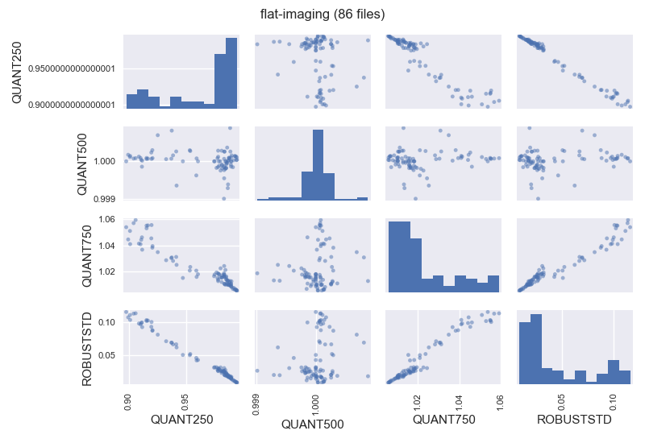

.. _flat-imaging_reduction:

*************************
Reduction of flat-imaging
*************************

.. note::

   **Filabres** computes master calibration images for each night. Within 
   each night, individual calibration exposures within a given time span (given
   by the keyword ``maxtimespan_hours`` in the file
   ``configuration_cafos.yaml``) are combined.  Note that in order to be
   included in a particular master calibration, the corresponding individual
   images should also have the same signature, i.e., the same values for the
   set of FITS keywords listed under ``signature`` in the file
   ``configuration_cafos.yaml`` for the considered image type (``bias``,
   ``flat-imaging``,...).

The reduction of flat-imaging files is quite similar to the process followed 
for the bias images. Note that now the signature of the images also depend on
the position of the grism wheel (no grism for imaging mode) and the filter
employed during the observation:

::

   $ filabres -rs flat-imaging
   * Number of nights found: 58

   * Working with night 170225_t2_CAFOS (1/58)
   ---
   Working with signature SITE#1d_15__1650__1650__[251,221:1900,1870]__1__1__GRISM-11__FILT- 9
   Creating flat-imaging/170225_t2_CAFOS/flat-imaging_caf-20170224-20:20:04-cal-krek_red.fits
   Creating flat-imaging/170225_t2_CAFOS/flat-imaging_caf-20170224-20:20:04-cal-krek_mask.fits
   ---
   Working with signature SITE#1d_15__1650__1650__[251,221:1900,1870]__1__1__GRISM-11__FILT- 9
   Creating flat-imaging/170225_t2_CAFOS/flat-imaging_caf-20170226-06:24:27-cal-krek_red.fits
   Creating flat-imaging/170225_t2_CAFOS/flat-imaging_caf-20170226-06:24:27-cal-krek_mask.fits
   ---
   Working with signature SITE#1d_15__1650__1650__[251,221:1900,1870]__1__1__GRISM-11__FILT-10
   Creating flat-imaging/170225_t2_CAFOS/flat-imaging_caf-20170224-20:49:51-cal-krek_red.fits
   Creating flat-imaging/170225_t2_CAFOS/flat-imaging_caf-20170224-20:49:51-cal-krek_mask.fits
   ...
   ...
   
   * Working with night 171230_t2_CAFOS (58/58)
   ---
   Working with signature SITE#1d_15__800__800__[601,601:1400,1400]__1__1__GRISM-11__FILT-11
   Creating flat-imaging/171230_t2_CAFOS/flat-imaging_caf-20171229-10:04:54-cal-lilj_red.fits
   Creating flat-imaging/171230_t2_CAFOS/flat-imaging_caf-20171229-10:04:54-cal-lilj_mask.fits
   ---
   Working with signature SITE#1d_15__800__800__[601,601:1400,1400]__1__1__GRISM-11__FILT-11
   Creating flat-imaging/171230_t2_CAFOS/flat-imaging_caf-20171231-06:30:10-cal-lilj_red.fits
   Creating flat-imaging/171230_t2_CAFOS/flat-imaging_caf-20171231-06:30:10-cal-lilj_mask.fits
   * program STOP

Several warning messages may appear during the reduction of these images
(ignore them).

Note that within each night one (or several) master flat-imaging frames (and
their associated mask images) are created.  The information on the terminal
indicates the corresponding signature.

The master flat-imaging frames are stored in the subdirectory ``flat-imaging``
under the current directory:

::

   $ tree flat-imaging
   flat-imaging/
   ├── 170225_t2_CAFOS
   │   ├── flat-imaging_caf-20170224-20:20:04-cal-krek_mask.fits
   │   ├── flat-imaging_caf-20170224-20:20:04-cal-krek_red.fits
   │   ├── flat-imaging_caf-20170224-20:49:51-cal-krek_mask.fits
   │   ├── flat-imaging_caf-20170224-20:49:51-cal-krek_red.fits
   │   ├── flat-imaging_caf-20170224-21:12:37-cal-krek_mask.fits
   │   ├── flat-imaging_caf-20170224-21:12:37-cal-krek_red.fits
   │   ├── flat-imaging_caf-20170225-18:28:50-cal-krek_mask.fits
   │   ├── flat-imaging_caf-20170225-18:28:50-cal-krek_red.fits
   │   ├── flat-imaging_caf-20170226-06:05:08-cal-krek_mask.fits
   │   ├── flat-imaging_caf-20170226-06:05:08-cal-krek_red.fits
   │   ├── flat-imaging_caf-20170226-06:24:27-cal-krek_mask.fits
   │   └── flat-imaging_caf-20170226-06:24:27-cal-krek_red.fits
   ├── 170319_t2_CAFOS
   │   ├── flat-imaging_caf-20170319-08:56:20-cal-agui_mask.fits
   │   └── flat-imaging_caf-20170319-08:56:20-cal-agui_red.fits
   ├── 170331_t2_CAFOS
   │   ├── flat-imaging_caf-20170401-05:16:29-cal-agui_mask.fits
   │   └── flat-imaging_caf-20170401-05:16:29-cal-agui_red.fits
   ...
   ...
   ├── 171228_t2_CAFOS
   │   ├── flat-imaging_caf-20171228-12:46:39-cal-agui_mask.fits
   │   ├── flat-imaging_caf-20171228-12:46:39-cal-agui_red.fits
   │   ├── flat-imaging_caf-20171228-13:14:11-cal-bard_mask.fits
   │   └── flat-imaging_caf-20171228-13:14:11-cal-bard_red.fits
   └── 171230_t2_CAFOS
       ├── flat-imaging_caf-20171229-10:04:54-cal-lilj_mask.fits
       ├── flat-imaging_caf-20171229-10:04:54-cal-lilj_red.fits
       ├── flat-imaging_caf-20171231-06:30:10-cal-lilj_mask.fits
       └── flat-imaging_caf-20171231-06:30:10-cal-lilj_red.fits

If you want to get more information concerning the reduction of these type of
images, just add -v to increase the verbosity level. For example, we can try to
repeat the reduction of the night ``170319_t2_CAFOS``:

::

   $ filabres -rs flat-imaging -n 170319* -v
   * instrument............: cafos
   * datadir...............: /Users/cardiel/CAFOS2017
   * ignored_images_file...: ignored_images.yaml
   * image_corrections_file: image_header_corrections.yaml
   * Loading instrument configuration
   * Number of nights found: 1
   * List of nights: ['170319_t2_CAFOS']
   
   Results database set to filabres_db_cafos_flat-imaging.json
      
   Subdirectory flat-imaging found
   
   * Working with night 170319_t2_CAFOS (1/1)
   Reading file ./lists/170319_t2_CAFOS/imagedb_cafos.json
   Number of flat-imaging images found 20
   Subdirectory flat-imaging/170319_t2_CAFOS found
   Number of different signatures found: 1
   Signature (1/1):
    - CCDNAME: SITE#1d_15
    - NAXIS1: 1024
    - NAXIS2: 1024
    - DATASEC: [513,513:1536,1536]
    - CCDBINX: 1
    - CCDBINY: 1
    - INSGRID: GRISM-11
    - INSFLID: FILT- 3
   Total number of images with this signature: 20
    - /Users/cardiel/CAFOS2017/170319_t2_CAFOS/caf-20170319-08:56:20-cal-agui.fits
    - /Users/cardiel/CAFOS2017/170319_t2_CAFOS/caf-20170319-08:57:25-cal-agui.fits
    - /Users/cardiel/CAFOS2017/170319_t2_CAFOS/caf-20170319-08:58:29-cal-agui.fits
    - /Users/cardiel/CAFOS2017/170319_t2_CAFOS/caf-20170319-08:59:34-cal-agui.fits
    - /Users/cardiel/CAFOS2017/170319_t2_CAFOS/caf-20170319-09:00:38-cal-agui.fits
    - /Users/cardiel/CAFOS2017/170319_t2_CAFOS/caf-20170319-09:01:46-cal-agui.fits
    - /Users/cardiel/CAFOS2017/170319_t2_CAFOS/caf-20170319-09:02:51-cal-agui.fits
    - /Users/cardiel/CAFOS2017/170319_t2_CAFOS/caf-20170319-09:03:55-cal-agui.fits
    - /Users/cardiel/CAFOS2017/170319_t2_CAFOS/caf-20170319-09:05:00-cal-agui.fits
    - /Users/cardiel/CAFOS2017/170319_t2_CAFOS/caf-20170319-09:06:04-cal-agui.fits
    - /Users/cardiel/CAFOS2017/170319_t2_CAFOS/caf-20170319-09:07:13-cal-agui.fits
    - /Users/cardiel/CAFOS2017/170319_t2_CAFOS/caf-20170319-09:08:18-cal-agui.fits
    - /Users/cardiel/CAFOS2017/170319_t2_CAFOS/caf-20170319-09:09:22-cal-agui.fits
    - /Users/cardiel/CAFOS2017/170319_t2_CAFOS/caf-20170319-09:10:27-cal-agui.fits
    - /Users/cardiel/CAFOS2017/170319_t2_CAFOS/caf-20170319-09:11:32-cal-agui.fits
    - /Users/cardiel/CAFOS2017/170319_t2_CAFOS/caf-20170319-09:12:40-cal-agui.fits
    - /Users/cardiel/CAFOS2017/170319_t2_CAFOS/caf-20170319-09:13:45-cal-agui.fits
    - /Users/cardiel/CAFOS2017/170319_t2_CAFOS/caf-20170319-09:14:49-cal-agui.fits
    - /Users/cardiel/CAFOS2017/170319_t2_CAFOS/caf-20170319-09:15:54-cal-agui.fits
    - /Users/cardiel/CAFOS2017/170319_t2_CAFOS/caf-20170319-09:16:58-cal-agui.fits
   -> Number of images with expected signature and within time span: 20
   File flat-imaging/170319_t2_CAFOS/flat-imaging_caf-20170319-08:56:20-cal-agui_red.fits already exists: skipping reduction.
   * program STOP

For this particular night, the all the flat-imaging files exhibit a single
signature. The 20 available individual frames where obtained within one hour.
For that reason all of them are selected to be combined in a single master
flat-imaging frame. The name of output file is taken from the first image in
the sequence of 20 images, adding the prefix ``flat-imaging_`` and the suffix
``_red`` (the latter prior to the extension ``.fits``). Note however that,
since filabres detects that the output image already exists, the output file is
not overwritten. You can force to overwrite the output file by using the
additional argument --force in the command line:

::

   $ filabres -rs flat-imaging -n 170319* -v --force
   ...
   ...
   -> Number of images with expected signature and within time span: 20
   -> output fname will be flat-imaging/170319_t2_CAFOS/flat-imaging_caf-20170319-08:56:20-cal-agui_red.fits
   -> output mname will be flat-imaging/170319_t2_CAFOS/flat-imaging_caf-20170319-08:56:20-cal-agui_mask.fits
   Deleting flat-imaging/170319_t2_CAFOS/flat-imaging_caf-20170319-08:56:20-cal-agui_red.fits
   Deleting flat-imaging/170319_t2_CAFOS/flat-imaging_caf-20170319-08:56:20-cal-agui_mask.fits
   WARNING: deleting previous database entry: flat-imaging --> SITE#1d_15__1024__1024__[513,513:1536,1536]__1__1__GRISM-11__FILT- 3 --> 57831.37960
   
   Calibration database set to filabres_db_cafos_bias.json
   -> looking for calibration bias with signature SITE#1d_15__1024__1024__[513,513:1536,1536]__1__1
   ->   mjdobsarray.......: [57831.39    57843.70215 57850.5884  57863.6782  57865.73029 57875.77454
    57878.44105 57892.5731  57898.82681 57900.68725 57901.68225 57906.55349
    57925.6386  57931.53584 57931.81129 57965.79275 57990.51175 57999.79004
    58014.69839 58024.43495 58025.51284 58025.      58028.75765 58032.62474
    58035.24015 58036.6024  58037.7204  58041.75144 58042.25475 58043.57286
    58057.54025 58057.59541 58065.69286 58077.70469 58078.67014 58115.57878]
   ->   looking for mjdobs: 57831.3724
   ->   nearest value is..: 57831.39000
   ->   delta_mjd (days)..: 0.017599999999220017
   Median value in frame #1/20: 34681.0
   Median value in frame #2/20: 34593.0
   Median value in frame #3/20: 34722.0
   Median value in frame #4/20: 34849.0
   Median value in frame #5/20: 34810.0
   Median value in frame #6/20: 34808.0
   Median value in frame #7/20: 34954.0
   Median value in frame #8/20: 34970.0
   Median value in frame #9/20: 35079.0
   Median value in frame #10/20: 35013.0
   Median value in frame #11/20: 35281.0
   Median value in frame #12/20: 35101.0
   Median value in frame #13/20: 35316.0
   Median value in frame #14/20: 35140.0
   Median value in frame #15/20: 35405.0
   Median value in frame #16/20: 35348.0
   Median value in frame #17/20: 35229.0
   Median value in frame #18/20: 35245.0
   Median value in frame #19/20: 35188.0
   Median value in frame #20/20: 35120.0
   Working with signature SITE#1d_15__1024__1024__[513,513:1536,1536]__1__1__GRISM-11__FILT- 3
   Creating flat-imaging/170319_t2_CAFOS/flat-imaging_caf-20170319-08:56:20-cal-agui_red.fits
   Creating flat-imaging/170319_t2_CAFOS/flat-imaging_caf-20170319-08:56:20-cal-agui_mask.fits
   * program STOP

Note that the reduction of the flat-imaging files requires the use of a master
bias with a particular signature (in this case 
``SITE#1d_15__1024__1024__[513,513:1536,1536]__1__1``). Several master bias
frames with this signature are found, each one with a different modified Julian
Date. The selected one is the closest, in time, with the observing time of the
flat images. The median value in each individual exposure is also shown (note
that his value is computed in the useful image region, where the computed mask
is different from zero).
   

Database of flat-imaging master frames
======================================

The reduction of the bias images generates a file, placed in the current
directory, called ``filabres_db_cafos_flat-imaging.json``. This constitutes a
database with the information of all the flat-imaging images, sorted by
signature and, within each signature, sorted by the Modified Julian Date (FITS
keyword MJD-OBS). In this way, when a master flat-imaging is needed in the
reduction of a scientific image, filabres can determine the required
calibration signature and then select the closest calibration to the
corresponding observation time.

The structure of ``filabres_db_cafos_flat-imaging.json`` is similar to the one
previously explained for ``filabres_db_cafos_bias.json``, and is not going to
be repeated here.

Checking the flat-imaging reduction
===================================

In order to obtain a list with al the reduced flat-imaging frames just execute:

::

   $ filabres -lr flat-imaging
                                                                                     file NAXIS1 NAXIS2
   1    flat-imaging/170225_t2_CAFOS/flat-imaging_caf-20170224-20:20:04-cal-krek_red.fits  1650   1650 
   2    flat-imaging/170225_t2_CAFOS/flat-imaging_caf-20170226-06:24:27-cal-krek_red.fits  1650   1650 
   3    flat-imaging/170225_t2_CAFOS/flat-imaging_caf-20170224-20:49:51-cal-krek_red.fits  1650   1650 
   ...
   ...
   129  flat-imaging/171225_t2_CAFOS/flat-imaging_caf-20171225-17:31:09-cal-bard_red.fits  1700   1700 
   130  flat-imaging/171225_t2_CAFOS/flat-imaging_caf-20171225-20:09:53-cal-bard_red.fits  1700   1700 
   131  flat-imaging/171228_t2_CAFOS/flat-imaging_caf-20171228-13:14:11-cal-bard_red.fits  1700   1700 
   Total: 131 files

The available keywords for these images are:

::

   (filabfes) $ filabres -lr flat-imaging -k all
   Valid keywords: ['NAXIS', 'NAXIS1', 'NAXIS2', 'OBJECT', 'RA', 'DEC',
   'EQUINOX', 'DATE', 'MJD-OBS', 'AIRMASS', 'EXPTIME', 'INSTRUME', 'CCDNAME',
   'ORIGSECX', 'ORIGSECY', 'CCDSEC', 'BIASSEC', 'DATASEC', 'CCDBINX',
   'CCDBINY', 'IMAGETYP', 'INSTRMOD', 'INSAPID', 'INSTRSCL', 'INSTRPIX',
   'INSTRPX0', 'INSTRPY0', 'INSFLID', 'INSFLNAM', 'INSGRID', 'INSGRNAM',
   'INSGRROT', 'INSGRWL0', 'INSGRRES', 'INSPOFPI', 'INSPOROT', 'INSFPZ',
   'INSFPWL', 'INSFPDWL', 'INSFPORD', 'INSCALST', 'INSCALID', 'INSCALNM',
   'NPOINTS', 'FMINIMUM', 'QUANT025', 'QUANT159', 'QUANT250', 'QUANT500',
   'QUANT750', 'QUANT841', 'QUANT975', 'FMAXIMUM', 'ROBUSTSTD', 'NORIGIN',
   'IERR_BIAS', 'DELTA_MJD_BIAS', 'IERR_FLAT']

Note some new useful keywords:

- ``IERR_BIAS``: flag that indicates whether there was a problem when trying to
  retrieve the master bias frame corresponding to the signature of the flat
  images. The value 0 means that the master bias was found, whereas a value of 1
  indicates that no master bias was found with the requested signature (in this
  case, the median value of the closest bias is chosen, independently of its
  signature).

- ``DELTA_MJD_BIAS``: time distance (days) between the master bias and the flat
  images being reduced.

- ``IERR_FLAT``: flag that indicates a problem in the reduction of the flat
  images themselves (a negative median signal for example). These image should
  be revised.

For example, it is possible to quickly determine if ``IERR_BIAS`` or
``IERR_FLAT`` are different
from zero in any of the reduced flat-imaging frames:

::

   $ filabres -lr flat-imaging --filter 'k[ierr_bias] != 0'
   Total: 0 files

::

   $ filabres -lr flat-imaging  --filter 'k[ierr_flat] != 0'
                                                                                      file NAXIS1 NAXIS2
   1  flat-imaging/170621_t2_CAFOS/flat-imaging_caf-20170621-21:31:58-cal-agui_red.fits  1024   1024 
   2  flat-imaging/170621_t2_CAFOS/flat-imaging_caf-20170622-02:41:15-cal-agui_red.fits  1024   1024 
   3  flat-imaging/170627_t2_CAFOS/flat-imaging_caf-20170627-20:57:40-cal-agui_red.fits  1024   1024 
   4  flat-imaging/171015_t2_CAFOS/flat-imaging_caf-20171016-10:15:35-cal-agui_red.fits  1024   1024 
   5  flat-imaging/170929_t2_CAFOS/flat-imaging_caf-20170929-13:52:28-cal-flat_red.fits  1024   1024 

There are five reduced flat-imaging frames with problems in the reduction of
the individual flat exposures.

(Work in progress from here!)

(Work in progress from here!)

(Work in progress from here!)

It is also useful to examine the ``QUANT500`` and ``ROBUSTSTD`` keywords:

::

   $ filabres -lr flat-imaging -k quant500 -k robuststd -pxy
   ...
   ...

Removing invalid reduced flat-imaging
=====================================

