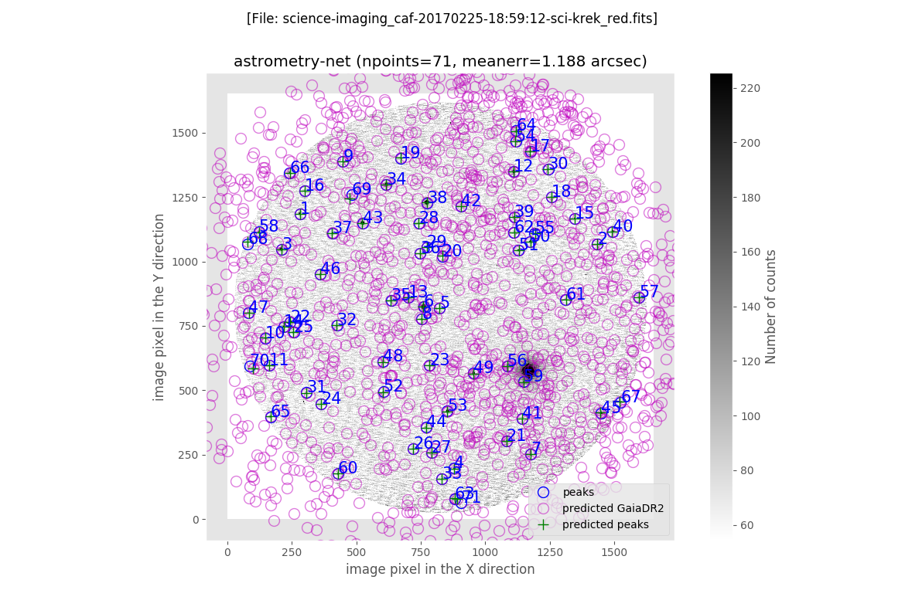
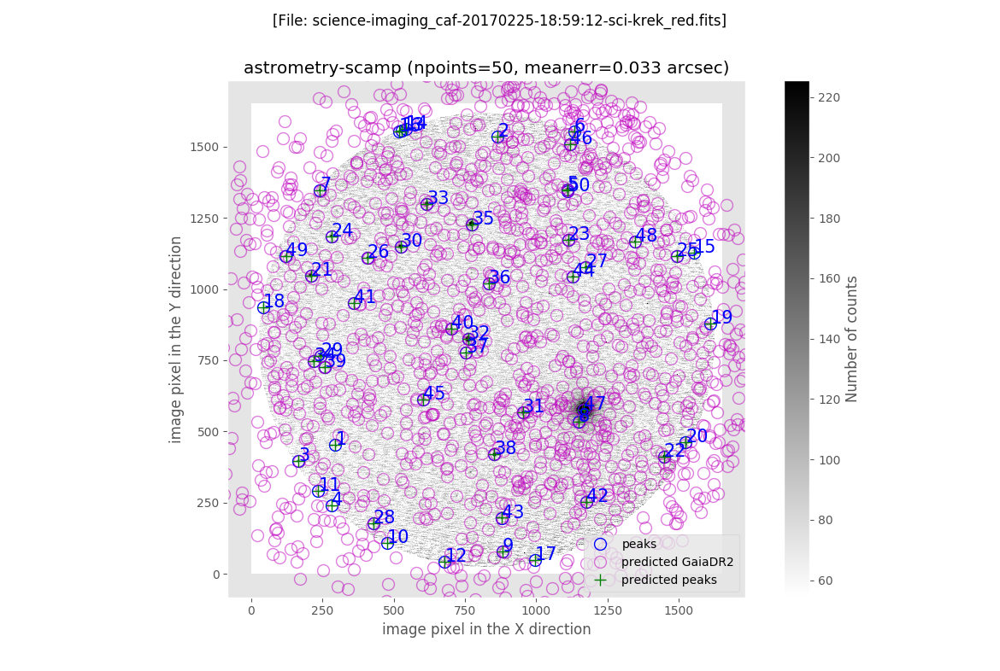

.. _reduction_of_science_imaging_frames:

***********************************
Reduction of science-imaging frames
***********************************

.. note::

   The reduction of science images is carried out individually, i.e., the
   scientific images are not combined within any time span prior to the
   reduction process (in fact, the value of ``maxtimespan_hours`` is set to
   zero in the file ``configuration_cafos.yaml``).

There are many individual images classified as ``science-imaging``:

::

  $ filabres -lc science-imaging
  ...
  ...
  Total: 4931 files

Only in the first night we have 48 images:

::

  $ filabres -lc science-imaging -n 170225*
                                                                                          file
  1   /Volumes/NicoPassport/CAHA/CAFOS2017/170225_t2_CAFOS/caf-20170225-18:59:12-sci-krek.fits
  2   /Volumes/NicoPassport/CAHA/CAFOS2017/170225_t2_CAFOS/caf-20170225-19:01:30-sci-krek.fits
  3   /Volumes/NicoPassport/CAHA/CAFOS2017/170225_t2_CAFOS/caf-20170225-19:04:18-sci-krek.fits
  ...
  ...
  46  /Volumes/NicoPassport/CAHA/CAFOS2017/170225_t2_CAFOS/caf-20170225-22:17:06-sci-krek.fits
  47  /Volumes/NicoPassport/CAHA/CAFOS2017/170225_t2_CAFOS/caf-20170225-22:18:58-sci-krek.fits
  48  /Volumes/NicoPassport/CAHA/CAFOS2017/170225_t2_CAFOS/caf-20170225-22:20:27-sci-krek.fits
  Total: 48 files

Considering the large number of images, it is advisable to start the reduction
of these scientific images by constraining the process to a subset of images.
In this sense, we can choose between the different options shown below. Note
that in all the following examples we are using enhanced verbosity (argument
``-v/--verbose``) and an interactive execution (argument
``-i/--interactive``; this is going to stop the reduction to show some
intermediate plots and results).

The different possibilities are (do not try these examples yet! their purpose
here is simply to illustrate the different approaches):

1. Reduce a single ``science-imaging`` image using the argument ``-n/--night``
   for the night and the argument ``--filename`` followed by the explicit name
   of the original FITS file (*without the file path*). For example, the first
   file of the first night is reduced executing:

   ::

     $ filabres -rs science-imaging -v -i -n 170225* --filename caf-20170225-18:59:12-sci-krek.fits

   Here we have specified the reduction step ``-rs science-imaging``, the use
   of enhanced verbosity ``-v``, the interactive execution of the program
   ``-i``, the observing night ``-n 170225*``, and the specific file to be
   reduced ``--filename caf-20170225-18:59:12-sci-krek.fits``.

2. Reduce all the ``science-imaging`` files within a given night. In this case
   just omit ``--filename <file>``. Only the night must be specified:

   ::

     $ filabres -rs science-imaging -v -i -n 170225*

   In this case you will probably prefer to execute the reduction of the files
   without ``-i``.

3. Reduce all the ``science-imaging`` files of all nights: if a specific night
   is not given, **filabres** will try to reduce all the images of this type,
   independently of the observing night:

   ::

     $ filabres -rs science-imaging -v -i

   In this case you will also prefer to execute the reduction of the files
   without ``-i`` (and also without ``-v``; relevant information concerning the
   reduction of each individual file is conveniently stored).

In the next section we are describing in detail the first scenario, i.e. the
reduction of a single ``science-imaging`` frame. The description is also valid
for the other to cases, where the reduction is extended to a large number of
files.

.. _reduction_of_a_single_science-imaging_frame:

Reduction of a single science-imaging frame
===========================================

.. warning::

   Note that the astrometric calibration is performed using GAIA data
   downloaded from the internet on real time while executing **filabres**. 
   This means that a live internet connection is required for the code to 
   work properly.

We illustrate this case using the first ``science-imaging`` file of the first 
night. As previously mentioned, the reduction of this particular image starts
by executing:

::

  $ filabres -rs science-imaging -v -i -n 170225* --filename caf-20170225-18:59:12-sci-krek.fits

.. warning::

   Do not get alarmed by the verbosity of the output generated by the reduction
   of this type of images. Here we are describing that output little by little.

   Note that you do not have to type anything of what is shown in this section:
   all the contents displayed are output generated by **filabres**, including
   the execution of external programs (displayed after the ``$`` symbol) which
   is automatically handled by the program.

The initial output shows basic information concerning the configuration files
employed by **filabres**:

::

  * instrument: cafos
  * datadir: /Volumes/NicoPassport/CAHA/CAFOS2017
  * ignored_images_file: ignored_images.yaml
  * image_header_corrections_file: image_header_corrections.yaml
  * forced_classifications_file: forced_classifications.yaml
  * Loading instrument configuration
  * Number of nights found: 1
  * List of nights: ['170225_t2_CAFOS']
  
  Subdirectory science-imaging not found. Creating it!

A new subdirectory, called ``science-imaging``, has been created under the
current directory. This new subdirectory will host a tree of subdirectories
(corresponding to different observing nights) where the reduction of the images
will take place and the associated files will be stored.

::

  * Working with night 170225_t2_CAFOS (1/1)
  Reading file ./lists/170225_t2_CAFOS/imagedb_cafos.json
  Number of science-imaging images found: 1
  Subdirectory science-imaging/170225_t2_CAFOS not found. Creating it!

Since we have specified a single image corresponding to an individual file,
**filabres** locates that image. In addition, since that image is the first one
to be reduced corresponding to the night ``170225_t2_CAFOS``, a subdirectory
with that name is created under the subdirectory ``science-imaging``. 

::

  Results database set to science-imaging/170225_t2_CAFOS/filabres_db_cafos_science-imaging.json

The basic information concerning the reduction of the image will be stored in a
database called ``filabres_db_cafos_science-imaging.json``.  Note that contrary
to what is done with the reduced calibrations, where all the information is
stored in a single database ``filabres_db_cafos_<calibration>.json`` (where
``<calibration>`` is ``bias`` or ``flat-imaging``), in the case of the science
images, that information is separately stored in independent files
``filabres_db_science-imaging.json`` located within the subdirectory reserved
for each observing night under the ``science-imaging`` subdirectory tree. In
addition to this, within the same subdirectory tree, a specific subdirectory is
also created for each reduced image, where **filabres** stores additional
auxiliary files created during the data reduction. This will be explained with
more detail below.

::

  -> input file name is......: /Volumes/NicoPassport/CAHA/CAFOS2017/170225_t2_CAFOS/caf-20170225-18:59:12-sci-krek.fits
  -> output file name will be: science-imaging/170225_t2_CAFOS/science-imaging_caf-20170225-18:59:12-sci-krek_red.fits

The absolute path to the input file name is shown, as well as the relative path
to the main output file, which basename is identical to the input file, adding
the previx ``science-imaging_`` and the suffix ``_red`` (the latter prior to
the extension ``.fits``).

Basic reduction of the image
----------------------------

The basic reduction of the image includes the bias subtraction and the
flatfielding.

::
  
  Calibration database set to filabres_db_cafos_bias.json
  -> looking for calibration bias with signature SITE#1d_15__1650__1650__[251,221:1900,1870]__1__1
  ->   mjdobsarray.......: [57808.89853]
  ->   looking for mjdobs: 57809.7911
  ->   nearest value is..: 57808.89853
  ->   delta_mjd (days)..: -0.8925700000036159

The master bias is retrieved by looking into the database
``filabres_db_cafos_bias.json``, and locating all the reduced master bias
frames with the expected signature (just one in this example). When several
master bias frames are available (with the required signature), the one closest
to the observation time of the scientific image is employed.

::

  Calibration database set to filabres_db_cafos_flat-imaging.json
  -> looking for calibration flat-imaging with signature SITE#1d_15__1650__1650__[251,221:1900,1870]__1__1__GRISM-11__FILT- 9__FREE__0
  ->   mjdobsarray.......: [57808.85161 57810.2688 ]
  ->   looking for mjdobs: 57809.7911
  ->   nearest value is..: 57810.26880
  ->   delta_mjd (days)..: 0.4776999999958207

The same action is performed with the flatfield. The master flatfield is
retrieved from the database ``filabres_db_cafos_flat-imaging.json``.

Astrometric calibration: description of the method
--------------------------------------------------

The astrometric calibration is performed in two steps:

1. Using Astrometry.net utilities: this provides an initial astrometric
   solution, making use of a gnomic projection with `SIP (Simple Imaging
   Polynomial)
   <https://irsa.ipac.caltech.edu/data/SPITZER/docs/files/spitzer/shupeADASS.pdf>`_ distortions: ``CTYPE1='RA---TAN-SIP'`` and ``CTYPE2='DEC--TAN-SIP'``. 

   The required binaries are:

   - ``build-astrometry-index``: computes a suitable index file (containing
     hash codes of typically sets of four stars) that facilitates the alignment
     of the requested image. Note that **filabres** does not use the
     pre-computed index files provided by Astrometry.net, but uses index files
     especially suited for each region of the sky covered by the science images.
     These files are built from GAIA data downloaded from the internet while
     executing the code. 

     Within each night, a database called ``central_pointings.json`` is created
     with the regions of the sky covered by the images already reduced for that
     observing night. This avoids the need to download GAIA data for images
     that correspond to close pointings by reusing already download data.

   - ``solve-field``: determines the astrometric calibration using the index
     file previously computed.

   The initial astrometric calibration provides typical errors of the order
   of the seeing, although we have checked that these errors are larger at
   the image borders in a systematic way, probably because the distortion is
   determined using second-order polynomials, which is not good enough.
   For that reason, this astrometric calibration is refined by using
   the AstrOmatic.net tools.

2. Using `AstrOmatic.net <https://www.astromatic.net/>`_ tools: ``SExtractor`` 
   and ``SCAMP`` are employed to detect the image sources and perform a refined
   astrometric calibration, using the `TPV World Coordinate System
   <https://fits.gsfc.nasa.gov/registry/tpvwcs/tpv.html>`_  to map the image
   distortions. The initial WCS solution provided by the Astrometry.net
   software allows ``SCAMP`` to determine a much better WCS solution by setting
   the TPV polynomial degrees to 3, leading to typical errors within a fraction
   of a pixel. Again, GAIA data is retrieved from the internet to carry out
   this astrometric calibration.

In the next subsections we describe how these two software packages are 
employed by **filabres**.

Astrometric calibration with Astrometry.net tools
-------------------------------------------------

::
  
  Astrometric calibration of science-imaging/170225_t2_CAFOS/science-imaging_caf-20170225-18:59:12-sci-krek_red.fits
  Creating configuration file science-imaging/170225_t2_CAFOS/work/myastrometry.cfg
  Central coordinates:
  <SkyCoord (FK5: equinox=2017-02-25T18:59:12.000): (ra, dec) in deg
      (58.824742, 53.26594)>
  <SkyCoord (FK5: equinox=J2000.000): (ra, dec) in deg
      (58.49578022, 53.21627399)>

A temporary ``work`` subdirectory is created under the subdirectory of the
observing night ``170225_t2_CAFOS``. This is the location where all the required
files will be placed in order to carry out the astrometric calibration.

The central coordinates of the field of view are read from the original FITS
keywords ``RA`` and ``DEC``. 

**Downloading the GAIA data**

::

  Subdirectory science-imaging/170225_t2_CAFOS/index000001 not found. Creating it!
  -> Creating science-imaging/170225_t2_CAFOS/index000001/gaialog.log
  ...
  (several WARNING messages to be ignored)
  ...

The central coordinates of the image to be processed are not close to any
previous location of the sky for the considered night (in fact, this is the
firs image to be reduced within that night). The data we are going to download
from the GAIA catalogue will be stored in a particular subdirectory
``index000001``. Those data will be reused for the astrometric calibration of
other images obtained in the same sky region. 

The file ``gaialog.log`` stores the GAIA query employed to download the data.
Here we are using the `Table Access Protocol (TAP)
<https://gaia.aip.de/cms/documentation/tap-interface/>`_ developed by IVOA to
perform the data retrieval.

::

  -> Gaia data: magnitude, nobjects: 30.000, 1602
  Querying GAIA data: 1602 objects found

There is a limit of 2000 sources that can be retrieved in a single synchronous
query to the GAIA data server. In this example, the number of sources, down to
magnitude 30.0, is 1602, which is already below that limit of 2000.  In more
crowded fields, **filabres** will adjust the limiting magnitude in order to get
the maximum number of sources, without exceeding 2000.

::

  -> Applying proper motion correction...
  ...
  (several WARNING messages to be ignored)
  ...
  -> Saving science-imaging/170225_t2_CAFOS/index000001/GaiaDR2-query.fits
  $ cp science-imaging/170225_t2_CAFOS/index000001/GaiaDR2-query.fits science-imaging/170225_t2_CAFOS/work/

The downloaded GAIA sources are corrected from proper motion. The corrected
catalogue is called ``GaiaDR2-query.fits`` (a binary table in FITS format). The
file is not only stored under ``index000001``, but also
copied into the ``work`` subdirectory for its immediate use.

::
  
  Generating reduced image science-imaging/170225_t2_CAFOS/work/xxx.fits (after bias subtraction and flatfielding)

A temporary version of the reduced scientific image (after bias subtraction and
flatfielding), named ``xxx.fits``, has also been saved into the ``work``
subdirectory.

**Building the index file**

At this point, **filabres** launches the execution of
``build-astrometry-index`` within the ``work`` subdirectory, generating the
index file ``index-image.fits``:

::

  *** Using Astrometry.net tools ***
  [Working in science-imaging/170225_t2_CAFOS/work]
  $ build-astrometry-index -i GaiaDR2-query.fits -o index-image.fits -A ra -D dec -S phot_g_mean_mag -P 2 -E -I 1

The output generated by the previous command is large:

::

  Reading GaiaDR2-query.fits...
  Got 1602 stars
  Sweep 1: 24 stars
  Sweep 2: 24 stars
  Sweep 3: 24 stars
  Sweep 4: 24 stars
  Sweep 5: 24 stars
  Sweep 6: 23 stars
  Sweep 7: 23 stars
  Sweep 8: 23 stars
  Sweep 9: 21 stars
  Sweep 10: 21 stars
  Total: 231 stars
  Writing output...
  First RA,Dec: 58.4315,53.2728
  First x,y,z: 0.313067,0.50951,0.801491
  Treetype: 0x10404
  After kdtree_build:
  kdtree:
    type 0x10404
    lr 0x7fc084409490
    perm 0x7fc0844090f0
    bb 0x0
    nbb 0
    split 0x7fc0844094d0
    splitdim 0x0
    dimbits 2
    dimmask 0x3
    splitmask 0xfffffffc
    data 0x7fc084804600
    free data 1
    range [-1, 1] [-1, 1] [-1, 1]
    scale 2.14748e+09
    invscale 4.65661e-10
    Ndata 231
    Ndim 3
    Nnodes 31
    Nbottom 16
    Ninterior 15
    Nlevels 5
    has_linear_lr 0
    name stars
  First data elements in tree: -929911,-1.19922e-116,-5.7116e+186
  Reading star kdtree /tmp/tmp.skdt.MrLOgt ...
  Will write to quad file /tmp/tmp.quad.Rm6hWZ and code file /tmp/tmp.code.lLGtFD
  Nside=880.  Nside^2=774400.  Number of healpixes=9292800.  Healpix side length ~ 3.99766 arcmin.
  Star tree contains 231 objects.
  Healpix radius 169.606 arcsec, quad scale 168 arcsec, total 340.982 arcsec
  Scanning 231 input stars...
  Will check 24 healpixes.
  Pass 1 of 16.
  Trying 24 healpixes.
  .......................
  Made 21 quads (out of 24 healpixes) this pass.
  Made 21 quads so far.
  Merging quads...
  Pass 2 of 16.
  Trying 24 healpixes.
  .......................
  Made 21 quads (out of 24 healpixes) this pass.
  Made 42 quads so far.
  Merging quads...
  Pass 3 of 16.
  Trying 24 healpixes.
  .......................
  Made 21 quads (out of 24 healpixes) this pass.
  Made 63 quads so far.
  Merging quads...
  Pass 4 of 16.
  Trying 24 healpixes.
  .......................
  Made 21 quads (out of 24 healpixes) this pass.
  Made 84 quads so far.
  Merging quads...
  Pass 5 of 16.
  Trying 24 healpixes.
  .......................
  Made 21 quads (out of 24 healpixes) this pass.
  Made 105 quads so far.
  Merging quads...
  Pass 6 of 16.
  Trying 24 healpixes.
  .......................
  Made 21 quads (out of 24 healpixes) this pass.
  Made 126 quads so far.
  Merging quads...
  Pass 7 of 16.
  Trying 24 healpixes.
  .......................
  Made 20 quads (out of 24 healpixes) this pass.
  Made 146 quads so far.
  Merging quads...
  Pass 8 of 16.
  Trying 24 healpixes.
  .......................
  Made 20 quads (out of 24 healpixes) this pass.
  Made 166 quads so far.
  Merging quads...
  Pass 9 of 16.
  Trying 24 healpixes.
  .......................
  Made 20 quads (out of 24 healpixes) this pass.
  Made 186 quads so far.
  Merging quads...
  Pass 10 of 16.
  Trying 24 healpixes.
  .......................
  Made 20 quads (out of 24 healpixes) this pass.
  Made 206 quads so far.
  Merging quads...
  Pass 11 of 16.
  Trying 24 healpixes.
  .......................
  Made 20 quads (out of 24 healpixes) this pass.
  Made 226 quads so far.
  Merging quads...
  Pass 12 of 16.
  Trying 24 healpixes.
  .......................
  Made 20 quads (out of 24 healpixes) this pass.
  Made 246 quads so far.
  Merging quads...
  Pass 13 of 16.
  Trying 24 healpixes.
  .......................
  Made 20 quads (out of 24 healpixes) this pass.
  Made 266 quads so far.
  Merging quads...
  Pass 14 of 16.
  Trying 24 healpixes.
  .......................
  Made 20 quads (out of 24 healpixes) this pass.
  Made 286 quads so far.
  Merging quads...
  Pass 15 of 16.
  Trying 24 healpixes.
  .......................
  Made 20 quads (out of 24 healpixes) this pass.
  Made 306 quads so far.
  Merging quads...
  Pass 16 of 16.
  Trying 24 healpixes.
  .......................
  Made 20 quads (out of 24 healpixes) this pass.
  Made 326 quads so far.
  Merging quads...
  Loosening reuse maximum to 9...
  Trying 58 healpixes.
  .........................................................
  Made 1 quads (out of 58 healpixes) this pass.
  Loosening reuse maximum to 10...
  Trying 57 healpixes.
  ........................................................
  Made 1 quads (out of 57 healpixes) this pass.
  Loosening reuse maximum to 11...
  Trying 56 healpixes.
  .......................................................
  Made 1 quads (out of 56 healpixes) this pass.
  Loosening reuse maximum to 12...
  Trying 55 healpixes.
  ......................................................
  Made 1 quads (out of 55 healpixes) this pass.
  Loosening reuse maximum to 13...
  Trying 54 healpixes.
  .....................................................
  Made 1 quads (out of 54 healpixes) this pass.
  Loosening reuse maximum to 14...
  Trying 53 healpixes.
  ....................................................
  Made 1 quads (out of 53 healpixes) this pass.
  Loosening reuse maximum to 15...
  Trying 52 healpixes.
  ...................................................
  Made 1 quads (out of 52 healpixes) this pass.
  Loosening reuse maximum to 16...
  Trying 51 healpixes.
  ..................................................
  Made 1 quads (out of 51 healpixes) this pass.
  Loosening reuse maximum to 17...
  Trying 50 healpixes.
  .................................................
  Made 1 quads (out of 50 healpixes) this pass.
  Loosening reuse maximum to 18...
  Trying 49 healpixes.
  ................................................
  Made 1 quads (out of 49 healpixes) this pass.
  Loosening reuse maximum to 19...
  Trying 48 healpixes.
  ...............................................
  Made 0 quads (out of 48 healpixes) this pass.
  Loosening reuse maximum to 20...
  Trying 48 healpixes.
  ...............................................
  Made 0 quads (out of 48 healpixes) this pass.
  Writing quads...
  Used 0.092124 s user, 0.00265 s system (0.094774 s total), 0.094853 s wall time since last check
  Done.
  codetree: building KD tree for /tmp/tmp.code.lLGtFD
         will write KD tree file /tmp/tmp.ckdt.qcwc4Z
  Reading codes...
  Read 336 codes.
  Building tree...
  Done
  Writing code KD tree to /tmp/tmp.ckdt.qcwc4Z...
  Unpermute-stars...
  Unpermuting stars from /tmp/tmp.skdt.MrLOgt and /tmp/tmp.quad.Rm6hWZ to /tmp/tmp.skdt2.qInvwK and /tmp/tmp.quad2.c9YLzG
  Reading star tree from /tmp/tmp.skdt.MrLOgt ...
  Reading quadfile from /tmp/tmp.quad.Rm6hWZ ...
  Writing quadfile to /tmp/tmp.quad2.c9YLzG ...
  Writing quads...
  ...............................................................................
  Writing star kdtree to /tmp/tmp.skdt2.qInvwK ...
  Permuting tag-along table...
  Unpermute-quads...
  Unpermuting quads from /tmp/tmp.quad2.c9YLzG and /tmp/tmp.ckdt.qcwc4Z to /tmp/tmp.quad3.b42npc and /tmp/tmp.ckdt2.1PzOO1
  Reading code tree from /tmp/tmp.ckdt.qcwc4Z ...
  Reading quads from /tmp/tmp.quad2.c9YLzG ...
  Writing quads to /tmp/tmp.quad3.b42npc ...
  Writing code kdtree to /tmp/tmp.ckdt2.1PzOO1 ...
  Merging /tmp/tmp.quad3.b42npc and /tmp/tmp.ckdt2.1PzOO1 and /tmp/tmp.skdt2.qInvwK to index-image.fits
  Reading code tree from /tmp/tmp.ckdt2.1PzOO1 ...
  Ok.
  Reading star tree from /tmp/tmp.skdt2.qInvwK ...
  Ok.
  Reading quads from /tmp/tmp.quad3.b42npc ...
  Ok.

**Solving the field**

Next, the field corresponding to the file ``xxx.fits`` (the reduced image) 
is solved using the index file just computed:

::

  [Working in science-imaging/170225_t2_CAFOS/work]
  $ solve-field -p --config myastrometry.cfg --overwrite --ra 58.495780218141974 --dec 53.21627398668612 --radius 0.13333333333333333 xxx.fits
  Reading input file 1 of 1: "xxx.fits"...
  Extracting sources...
  simplexy: found 185 sources.
  Solving...
  Reading file "./xxx.axy"...
  Only searching for solutions within 0.133333 degrees of RA,Dec (58.4958,53.2163)
  Field 1 did not solve (index index-image.fits, field objects 1-10).
  mo field stars:
    star 10; field_xy 616.2,1298.1, field_orig 616.2,1298.1
    star 1; field_xy 760.8,823.6, field_orig 760.8,823.6
    star 2; field_xy 773.8,1227.7, field_orig 773.8,1227.7
    star 3; field_xy 524.6,1148.6, field_orig 524.6,1148.6
    log-odds ratio 182.725 (2.27127e+79), 63 match, 2 conflict, 87 distractors, 162 index.
    RA,Dec = (58.497,53.2251), pixel scale 0.525226 arcsec/pix.
    Hit/miss:   Hit/miss: ++-+--+-+-----c+--+---+++--++-+--+++-+---++++----++++---++------+++--+-+---+--++++---+--+---+-++--+-
  Field 1: solved with index index-image.fits.
  Field 1 solved: writing to file ./xxx.solved to indicate this.
  Field: xxx.fits
  Field center: (RA,Dec) = (58.497161, 53.225216) deg.
  Field center: (RA H:M:S, Dec D:M:S) = (03:53:59.319, +53:13:30.779).
  Field size: 14.3725 x 14.3903 arcminutes
  Field rotation angle: up is 86.6417 degrees E of N
  Field parity: pos
  Creating new FITS file "./xxx.new"...

The previous command finds the sources, generating a binary FITS table called
``xxx.axy``. Immediately after that, the field is solved using the location of
those sources. The file ``xxx.new`` is a first version of the reduced image
containing an astrometric calibration.

Before leaving the astrometric calibration with the Astrometry.net tools,
**filabres** determines if any of the sources found in the image ``xxx.fits``
is saturated. If this is the case, the saturated objects can be removed from
the file ``xxx.axy``, which allows to solve again for a new astrometric
solution. Note that the new execution of ``solve-field`` uses as input the
updated ``xxx.axy`` file instead of the original ``xxx.fits`` image.

::

  Checking file: science-imaging/170225_t2_CAFOS/work/xxx.axy
  Number of saturated objects found: 1/185
  Saturated object: (1167.2056, 576.06335, 64436.547, 84.54297)
  File: science-imaging/170225_t2_CAFOS/work/xxx.axy updated

  [Working in science-imaging/170225_t2_CAFOS/work]
  $ solve-field -p --config myastrometry.cfg --continue --width 1650 --height 1650 --x-column X --y-column Y --sort-column FLUX --ra 58.495780218141974 --dec 53.21627398668612 --radius 0.13333333333333333 xxx.axy
  Reading input file 1 of 1: "xxx.axy"...
  Reading sort column "FLUX"
  Sorting sort column
  mmapping input file
  Copying table header.
  Writing row 0
  Done
  Solving...
  Reading file "./xxx.axy"...
  Only searching for solutions within 0.133333 degrees of RA,Dec (58.4958,53.2163)
  Field 1 did not solve (index index-image.fits, field objects 1-10).
  mo field stars:
    star 10; field_xy 616.2,1298.1, field_orig 616.2,1298.1
    star 0; field_xy 760.8,823.6, field_orig 760.8,823.6
    star 1; field_xy 773.8,1227.7, field_orig 773.8,1227.7
    star 2; field_xy 524.6,1148.6, field_orig 524.6,1148.6
    log-odds ratio 177.04 (7.72096e+76), 62 match, 2 conflict, 87 distractors, 162 index.
    RA,Dec = (58.497,53.2251), pixel scale 0.525226 arcsec/pix.
    Hit/miss:   Hit/miss: ++-+--+-+-----c+--+---+-+--++-+--+++-++--++++----+++----++------+++--+-+---+--+-++---+-------++++-+-
  Field 1: solved with index index-image.fits.
  Field 1 solved: writing to file ./xxx.solved to indicate this.
  Field: xxx.axy
  Field center: (RA,Dec) = (58.497172, 53.225206) deg.
  Field center: (RA H:M:S, Dec D:M:S) = (03:53:59.321, +53:13:30.742).
  Field size: 14.3712 x 14.3898 arcminutes
  Field rotation angle: up is 86.638 degrees E of N
  Field parity: pos

The last execution of ``solve-field``, which used ``xxx.axy`` as input, instead
of ``xxx.fits``, does not automatically generate a final image ``xxx.new`` with
the astrometric calibration incorporated into the FITS header. Instead, only
the WCS solution is saved in the file ``xxx.wcs``. For that reason, we have to
insert that WCS solution into the reduced image ``xxx.fits``. Fortunately, the
utility ``new-wcs`` performs this tasks for us:

::

  [Working in science-imaging/170225_t2_CAFOS/work]
  $ new-wcs -i xxx.fits -w xxx.wcs -o xxx.new -d
  WARNING: FITSFixedWarning: The WCS transformation has more axes (2) than the image it is associated with (0) [astropy.wcs.wcs]

**Results of the initial astrometric calibration**

The last output corresponding to the execution of Astrometry.net tools is a
brief summary displaying the plate scales (arcsec/pix), the number of sources
found, the mean error (in arcsec), and some of the outliers.

::

  astrometry.net> pixel scales (arcsec/pix): [0.52343268 0.52341089]
  astrometry-net> Number of targest found: 71
  astrometry-net> Mean error (arcsec)....: 1.1879683209341652
  -> outlier point #68, delta_r (arcsec): 5.620631094480526
  -> outlier point #69, delta_r (arcsec): 8.548273785024582
  -> outlier point #70, delta_r (arcsec): 8.712019148806954
  -> outlier point #71, delta_r (arcsec): 10.140383487868942

In addition to the displayed numerical summary, several plots are created
showing the result of the astrometric calibration obtained with Astrometry.net.
*Note that when running the program interactively, you can use all the options
that are available in the navigation toolbar of the matplotlib windows,
including pan, zoom, etc.*

The first plot shows the error between the predicted location of the sources
(using the derived astrometric solution) and the peak positions found in the
image. Each object is labelled with a number, that increases with the total
error, i.e. distance to the (0,0) point in the plot:

The next two plots are histograms with the errors in X and Y:

.. image:: images/astrometry-net_image1_plot2.png
   :width: 100%
   :alt: astrometry.net image 1 plot 2

The final plot is an image of the scientific image: the blue circles represent
the peak of the detected sources, the magenta crosses are the predicted
location of all the GAIA sources in a slightly larger field of view (the one
for wich the GAIA data was retrieved), and the green crosses indicate the
predicted positions of the detected sources.

Astrometric calibration with AstrOmatic.net tools
-------------------------------------------------

The initial astrometric calibration obtained with the Astrometry.net tools is
refined now using the AstrOmatic software.

**Creating the configuration files**

The first step is the generation of the configuration files required by
``SExtractor`` and ``SCAMP``.

::

  *** Using AstrOmatic.net tools ***
  Generating science-imaging/170225_t2_CAFOS/work/default.param
  Generating science-imaging/170225_t2_CAFOS/work/config.sex
  Generating science-imaging/170225_t2_CAFOS/work/config.scamp

**Running ``SExtractor``**

Next, ``SExtractor`` is executed in order to build the catalog of objects in
the reduced image, which will be called ``xxx.ldac``.
::

  [Working in science-imaging/170225_t2_CAFOS/work]
  $ sex xxx.new -c config.sex -CATALOG_NAME xxx.ldac

The output of the execution of ``SExtractor`` is also shown:

::

  > 
  ----- SExtractor 2.25.0 started on 2020-03-20 at 20:42:49 with 1 thread
  
  > Setting catalog parameters
  > Initializing catalog
  > Looking for xxx.new
  ----- Measuring from: xxx.new
        "IC342 g'" / no ext. header / 1650x1650 / 32 bits (floats)
  Detection+Measurement image: > Setting up background maps
  > Setting up background map at line:   64
  > Setting up background map at line:  128
  > Setting up background map at line:  192
  > Setting up background map at line:  256
  > Setting up background map at line:  320
  > Setting up background map at line:  384
  > Setting up background map at line:  448
  > Setting up background map at line:  512
  > Setting up background map at line:  576
  > Setting up background map at line:  640
  > Setting up background map at line:  704
  > Setting up background map at line:  768
  > Setting up background map at line:  832
  > Setting up background map at line:  896
  > Setting up background map at line:  960
  > Setting up background map at line: 1024
  > Setting up background map at line: 1088
  > Setting up background map at line: 1152
  > Setting up background map at line: 1216
  > Setting up background map at line: 1280
  > Setting up background map at line: 1344
  > Setting up background map at line: 1408
  > Setting up background map at line: 1472
  > Setting up background map at line: 1536
  > Setting up background map at line: 1600
  > Filtering background map(s)
  > Computing background d-map
  > Computing background-noise d-map
  (M+D) Background: 68.3404    RMS: 13.9395    / Threshold: 69.6973    
  > Scanning image
  > Line:   25  Objects:        0 detected /        0 sextracted
  > Line:   50  Objects:        7 detected /        0 sextracted
  > Line:   75  Objects:       19 detected /        0 sextracted
  > Line:  100  Objects:       20 detected /        0 sextracted
  > Line:  125  Objects:       32 detected /        0 sextracted
  > Line:  150  Objects:       32 detected /        0 sextracted
  > Line:  175  Objects:       32 detected /        0 sextracted
  > Line:  200  Objects:       33 detected /        0 sextracted
  > Line:  225  Objects:       34 detected /        0 sextracted
  > Line:  250  Objects:       35 detected /        0 sextracted
  > Line:  275  Objects:       36 detected /        0 sextracted
  > Line:  300  Objects:       38 detected /        0 sextracted
  > Line:  325  Objects:       38 detected /        0 sextracted
  > Line:  350  Objects:       38 detected /        0 sextracted
  > Line:  375  Objects:       38 detected /        0 sextracted
  > Line:  400  Objects:       38 detected /        0 sextracted
  > Line:  425  Objects:       40 detected /        0 sextracted
  > Line:  450  Objects:       41 detected /        0 sextracted
  > Line:  475  Objects:       43 detected /        0 sextracted
  > Line:  500  Objects:       43 detected /        0 sextracted
  > Line:  525  Objects:       43 detected /        0 sextracted
  > Line:  550  Objects:       44 detected /        0 sextracted
  > Line:  575  Objects:       46 detected /        0 sextracted
  > Line:  600  Objects:       46 detected /        0 sextracted
  > Line:  625  Objects:       48 detected /        0 sextracted
  > Line:  650  Objects:       48 detected /        0 sextracted
  > Line:  675  Objects:       48 detected /        0 sextracted
  > Line:  700  Objects:       48 detected /        0 sextracted
  > Line:  725  Objects:       48 detected /        0 sextracted
  > Line:  750  Objects:       49 detected /        0 sextracted
  > Line:  775  Objects:       51 detected /        0 sextracted
  > Line:  800  Objects:       52 detected /        0 sextracted
  > Line:  825  Objects:       52 detected /        0 sextracted
  > Line:  850  Objects:       53 detected /        0 sextracted
  > Line:  875  Objects:       54 detected /        0 sextracted
  > Line:  900  Objects:       56 detected /        0 sextracted
  > Line:  925  Objects:       56 detected /        0 sextracted
  > Line:  950  Objects:       60 detected /        0 sextracted
  > Line:  975  Objects:       61 detected /        0 sextracted
  > Line: 1000  Objects:       61 detected /        0 sextracted
  > Line: 1025  Objects:       62 detected /        0 sextracted
  > Line: 1034  Objects:       62 detected /        0 sextracted
  > Line: 1050  Objects:       63 detected /        3 sextracted
  > Line: 1075  Objects:       64 detected /        3 sextracted
  > Line: 1100  Objects:       65 detected /        4 sextracted
  > Line: 1125  Objects:       68 detected /        6 sextracted
  > Line: 1150  Objects:       70 detected /        6 sextracted
  > Line: 1175  Objects:       72 detected /        7 sextracted
  > Line: 1200  Objects:       74 detected /        8 sextracted
  > Line: 1225  Objects:       74 detected /        8 sextracted
  > Line: 1250  Objects:       75 detected /       10 sextracted
  > Line: 1275  Objects:       75 detected /       10 sextracted
  > Line: 1300  Objects:       75 detected /       12 sextracted
  > Line: 1325  Objects:       76 detected /       12 sextracted
  > Line: 1350  Objects:       77 detected /       12 sextracted
  > Line: 1375  Objects:       79 detected /       12 sextracted
  > Line: 1400  Objects:       79 detected /       12 sextracted
  > Line: 1425  Objects:       79 detected /       12 sextracted
  > Line: 1450  Objects:       79 detected /       12 sextracted
  > Line: 1475  Objects:       79 detected /       12 sextracted
  > Line: 1500  Objects:       79 detected /       12 sextracted
  > Line: 1525  Objects:       80 detected /       12 sextracted
  > Line: 1550  Objects:       81 detected /       12 sextracted
  > Line: 1575  Objects:       95 detected /       12 sextracted
  > Line: 1600  Objects:       95 detected /       12 sextracted
  > Line: 1625  Objects:       95 detected /       12 sextracted
  > Line: 1650  Objects:       95 detected /       12 sextracted
        Objects: detected 95       / sextracted 53              
  
  > Closing files
  > 
  > All done (in 0.1 s: 14925.8 lines/s , 479.4 detections/s)

**Running ``SCAMP``**

Finally, ``SCAMP`` is executed to compute the refined astrometric calibration.
::

  [Working in science-imaging/170225_t2_CAFOS/work]
  $ scamp xxx.ldac -c config.scamp

The output of the execution of ``SCAMP`` is shown next:

::

  > WARNING: FGROUP_RADIUS keyword unknown
  
  
  > WARNING: Obsolete configuration; replacing cocat1.u-strasbg.fr with vizier.u-strasbg.fr
  
  ----- SCAMP 2.7.8 started on 2020-03-20 at 20:42:49 with 8 threads
  
  ----- 1 inputs:
  xxx.ldac:  "IC342 g'           "  no ext. header   1 set      50 detections
  
  ----- 50 detections loaded
  
  ----- 1 instrument found for astrometry:
  
  Instrument A1 :
  1 extensions
  FILTER  =                                                                       
  QRUNID  =                                                                       
  
  ----- 1 instrument found for photometry:
  
  Instrument P1 :
  FILTER  =                                                                       
  
  ----- 1 field group found:
  
   Group  1: 1 field at 03:53:59.31 +53:13:30.8 with radius 10.18'
                    instruments  epoch      center coordinates     radius   scale 
  xxx.ldac             A1  P1    2017.2  03:53:59.31 +53:13:30.8   10.18'  0.5234"
  
  ----- Reference catalogs:
  
   Group  1:    13689 standards found in GAIA-DR2 (G band)
  
  ----- Astrometric matching:
  
   Group  1:    13689 standards in GAIA-DR2 (band G)
                instruments  pos.angle   scale    cont.        shift        cont.
  xxx.ldac           A1  P1  +0.00 deg  0.5234"  0.697   +0.051"   -0.30"   3.45
  
   
  ----- Astrometric clipping:
  
   Group  1: 4/34 detections removed
   
  ----- Astrometric stats (internal) :
  
                    All detections         |           High S/N           
             dAXIS1  dAXIS2   chi2   ndets | dAXIS1  dAXIS2   chi2   ndets
  Group  1:      0"      0"      0      29      0"      0"      0      10
   
  ----- Astrometric stats (external):
  
                    All detections         |           High S/N           
             dAXIS1  dAXIS2   chi2  nstars | dAXIS1  dAXIS2   chi2  nstars
  Group  1: 0.0526" 0.0487"    6.1      29 0.0249" 0.0112"     10      10
   
  ----- Photometric clipping:
  
   Group  1 / P1  : 0/29 detections removed
   
  ----- Photometric stats (internal):
  
                       All detections     |        High S/N        
           Instru mag RMS    chi2   ndets | mag RMS    chi2   ndets
  Group  1: P1        0       0      29       0       0      10
   
  ----- Photometric stats (external):
  
                       All detections     |        High S/N        
           Instru mag RMS    chi2  nstars | mag RMS    chi2  nstars

**Results of the new astrometric calibration**

The final image after the execution of the AstrOmatic.net tools is then 
generated:

::

  -> file science-imaging/170225_t2_CAFOS/science-imaging_caf-20170225-18:59:12-sci-krek_red.fits created

The next output is a brief summary displaying the plate scales (arcsec/pix),
the number of sources found, the mean error (in arcsec), and some of the
outliers:

::

  -> file science-imaging/170225_t2_CAFOS/science-imaging_caf-20170225-18:59:12-sci-krek_red.fits created
  astrometry> pixel scales (arcsec/pix): [0.52343268 0.52341089]
  Reading science-imaging/170225_t2_CAFOS/work/full_1.cat
  X_IMAGE is located in column #6
  Y_IMAGE is located in column #7
  CATALOG_NUMBER is located in column #2
  Number of objects read: 50
  Reading science-imaging/170225_t2_CAFOS/work/merged_1.cat
  ALPHA_J2000 is located in column #4
  DELTA_J2000 is located in column #5
  astrometry-scamp> Number of targest found: 50
  astrometry-scamp> Mean error (arcsec)....: 0.032813825746896653
  -> outlier point #47, delta_r (arcsec): 0.15799448046263975
  -> outlier point #48, delta_r (arcsec): 0.1599908735307402
  -> outlier point #49, delta_r (arcsec): 0.18797255871764804
  -> outlier point #50, delta_r (arcsec): 0.19884266054034697

In addition, **filabres** generates the same plots previously displayed when
computing the astrometric solution with the Astrometry.net software. In this
case it is clear the reduction of the error on the astrometric solution.

**Storing the results**

**Filabres** stores not only the reduced image, but also some auxiliary files
associated to the astrometric calibration.  All that information is kept under
a subdirectory with the same name as the reduced image (without the ``.fits``
extension):

::

  Subdirectory science-imaging/170225_t2_CAFOS/science-imaging_caf-20170225-18:59:12-sci-krek_red not found. Creating it!
  [Working in science-imaging/170225_t2_CAFOS/work]
  $ cp astrometry-net.pdf ../science-imaging_caf-20170225-18:59:12-sci-krek_red/
  [Working in science-imaging/170225_t2_CAFOS/work]
  $ cp astrometry-scamp.pdf ../science-imaging_caf-20170225-18:59:12-sci-krek_red/
  [Working in science-imaging/170225_t2_CAFOS/work]
  $ cp astrometry.log ../science-imaging_caf-20170225-18:59:12-sci-krek_red/
  [Working in science-imaging/170225_t2_CAFOS/work]
  $ cp xxx.new ../science-imaging_caf-20170225-18:59:12-sci-krek_red/
  [Working in science-imaging/170225_t2_CAFOS/work]
  $ cp full_1.cat ../science-imaging_caf-20170225-18:59:12-sci-krek_red/
  [Working in science-imaging/170225_t2_CAFOS/work]
  $ cp merged_1.cat ../science-imaging_caf-20170225-18:59:12-sci-krek_red/
  Press 'x' + <ENTER> to stop, or simply <ENTER> to continue... 

Those files include a log file with the output of the astrometric calibration,
the PDF version of the previously displayed plots, the reduced image after the
initial astrometric calibration with Astrometry.net (this file is called
``xxx.new``), and some catalogues generated by AstrOmatic.net.

.. _reducing_multiple_science-imaging_files:

Reducing multiple science-imaging files
=======================================

The previous sections have illustrated the reduction of a single
``science-imaging`` frame. As previously mentioned, this process can be
trivially executed with all the similar images in a particular night by
avoiding the use of the ``--filename`` argument. In addition, it is also
convenient to exclude the use of ``-i/--interactive`` to prevent **filabres**
from pausing the reduction after finishing each scientific image:

::

  $ filabres -rs science-imaging -v -n 170225*

or even to all nights by removing the ``-n/--night`` argument:

::

  $ filabres -rs science-imaging -v

.. _checking_the_science-imaging_reduction:

Checking the science-imaging reduction
======================================

To check the results of the ``science-imaging`` files, you can use the
``-lr/--list_reduced`` argument, as previouly described for the calibration
images.

::

  $ filabres -lr science-imaging
  ...
  ...

  $ filabres -lr science-imaging -k all
  ...
  ...

It is interesting to check whether there has been any error when retrieveing
the bias and flatfield calibrations, or during the astrometric calibration:

::

  $ filabres -lr science-imaging -k ierr_bias -k ierr_flat -k ierr_astr
    IERR_BIAS IERR_FLAT IERR_ASTR                                                                                     file
  1  0         0         0         science-imaging/170225_t2_CAFOS/science-imaging_caf-20170225-18:59:12-sci-krek_red.fits
  Total: 1 files
  

Removing invalid reduced science-imaging frames
===============================================

To remove a particular reduced ``science-imaging`` result, it is important to
delete not only the actual FITS file, but also the associated files
stored during the data reduction, as well as the corresponding entry in the
database file ``filabres_db_cafos_science-imaging.json``.  Fortunately, all
these actions are performed automatically by **filabres** using the
``--delete`` argument followed by the full path to the reduced file:

::

  filabres --delete science-imaging/170225_t2_CAFOS/science-imaging_caf-20170225-18:59:12-sci-krek_red.fits
  Image to be deleted science-imaging/170225_t2_CAFOS/science-imaging_caf-20170225-18:59:12-sci-krek_red.fits
  -> Deleting entry in science-imaging/170225_t2_CAFOS/filabres_db_cafos_science-imaging.json
  -> Updating science-imaging/170225_t2_CAFOS/filabres_db_cafos_science-imaging.json
  -> Deleting file: science-imaging/170225_t2_CAFOS/science-imaging_caf-20170225-18:59:12-sci-krek_red.fits
  -> Removing file: science-imaging/170225_t2_CAFOS/science-imaging_caf-20170225-18:59:12-sci-krek_red/astrometry-scamp.pdf
  -> Removing file: science-imaging/170225_t2_CAFOS/science-imaging_caf-20170225-18:59:12-sci-krek_red/astrometry-net.pdf
  -> Removing file: science-imaging/170225_t2_CAFOS/science-imaging_caf-20170225-18:59:12-sci-krek_red/merged_1.cat
  -> Removing file: science-imaging/170225_t2_CAFOS/science-imaging_caf-20170225-18:59:12-sci-krek_red/full_1.cat
  -> Removing file: science-imaging/170225_t2_CAFOS/science-imaging_caf-20170225-18:59:12-sci-krek_red/xxx.new
  -> Removing file: science-imaging/170225_t2_CAFOS/science-imaging_caf-20170225-18:59:12-sci-krek_red/astrometry.log
  -> Removing subdirectory: science-imaging/170225_t2_CAFOS/science-imaging_caf-20170225-18:59:12-sci-krek_red
  * program STOP 
